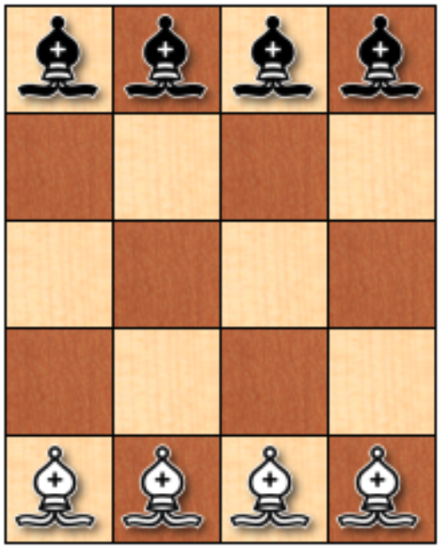
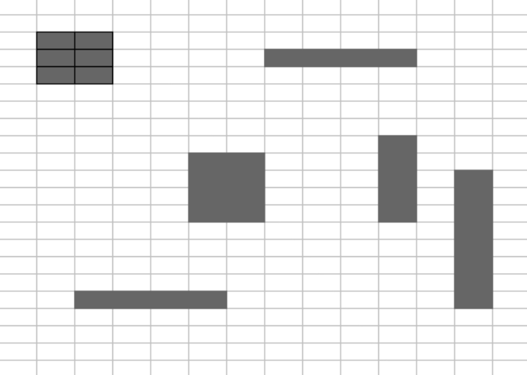
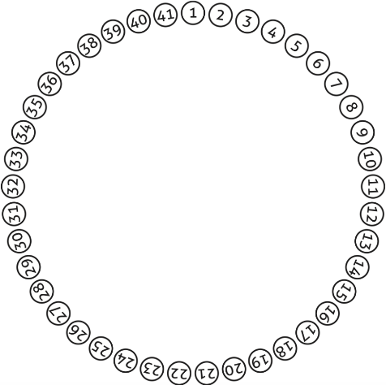
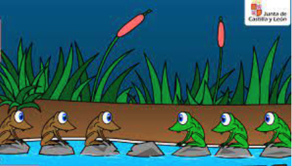
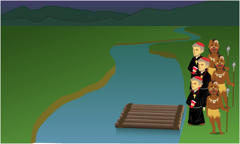

# Actividades Agosto - Diciembre 2023

---

 ***Profesor: Jesus Eduardo Alcaráz Chávez***
 
 ***Alumno: Edgar Carrillo Estrada***
 
 ***Fecha de entrega: 7 de Diciembre 2023***
 
---

## Índice
1. [*Introducción a la Inteligencia Artificial Actividad 1. Práctica 1*](#Elemento1)
2. [*Introducción a la Inteligencia Artificial: Tipos de Inteligencia*](#Elemento2)
3. [*Introducción a la Inteligencia Artificial: Introspección*](#Elemento3)
4. [*Introducción a la Inteligencia Artificial: Introspección*](#Elemento4)
5. [*Introducción a la Inteligencia Artificial: Introspección*](#Elemento5)
6. [*Introducción a la Inteligencia Artificial: El proceso de razonamiento según la lógica*](#Elemento6)
7. [*Introducción a la Inteligencia Artificial: El papel de la heurística*](#Elemento7)
8. [*Reglas y Búsquedas: Espacio de Estados*](#Elemento8)
9. [*Generación de Dataset*](#Elemento9)

---

## 1. Introducción a la Inteligencia Artificial Actividad 1. Práctica 1

Los hombres se han denominado a sí mismos como Homo sapiens (hombre sabio) porque nuestras capacidades mentales son muy importantes para nosotros. Durante miles de años, hemos tratado de entender cómo pensamos; es decir, entender cómo un simple puñado de materia puede percibir, entender, predecir y manipular un mundo mucho más grande y complicado que ella misma. El campo de la inteligencia artificial, o IA, va más allá: no sólo intenta comprender, sino que también se esfuerza en construir entidades inteligentes.

Dado el texto anterior, se requiere hacer lo siguiente.

- Redactar un ensayo mínimo 2000 palabras, del capítulo 1,2, 26, 27, y el apartado A del libro: "Inteligencia Artificial. Un enfoque moderno".

---
***Ensayo***

Antes de poder empezar en forma con el tema de inteligencia artificial, debemos de establecer un punto de partida para poder estar dentro de la misma idea sobre qué es y qué aspectos se contemplan.

La inteligencia artificial se puede definir de distintas maneras dependiendo del enfoque que le queramos dar. Existen 4 enfoques generales con algunos ejemplos de sus definiciones:

- Sistemas que piensan como humanos
“El nuevo y excitante esfuerzo de hacer que los computadores piensen… máquinas con mentes, en el más amplio sentido literal” (Haugeland, 1985).
“La automatización de actividades que vinculamos con procesos de pensamiento humano, actividades como la toma de decisiones, resolución de problemas, aprendizaje…” (Bellman, 1978)

- Sistemas que actúan como humanos
“El arte de desarrollar máquinas con capacidad para realizar funciones que cuando son realizadas por personas requieren de inteligencia” (Kurzweil, 1990)
“El estudio de cómo lograr que los computadores realicen tareas que, por el momento, los humanos hacen mejor” (Rich Y Knight, 1991)

- Sistemas que piensan racionalmente
“El estudio de las facultades mentales mediante el uso de los modelos computacionales” (Charniak y McDermott, 1985)
“El estudio de los cálculos que hacen posible percibir, razonar y actuar” (Winston, 1992)

- Sistemas que actúan racionalmente
“La Inteligencia Computacional es le estudio del diseño de agentes inteligentes” (Poole et al., 1998)
“IA… está relacionada con conductas inteligentes en artefactos” (Nilsson, 1998)

Una vez que hemos definido que es una inteligencia artificial, podemos empezar a evaluarlas con mayor detalle. Para evaluar una inteligencia artificial, Alan Turing creo la famosa “Prueba de Turing”. Esta prueba se puede aplicar para evaluar un equipo de cómputo debe de tener la capacidad de procesamiento de lenguaje natural, representacion del conocimiento, razonamiento automático y aprendizaje automático. También existe una llamada Prueba Global de Turing la cual evalúa todo lo anterior y le agrega la visión computacional y robótica.

Para poder generar una inteligencia artificial que simule a un humano, primero debemos de poder entender cómo es que piensa un humano. Para poder hacer esto, existen dos formas posibles: por medio de la introspección y mediante experimentos psicológicos. En el campo interdisciplinario de la ciencia cognitiva convergen modelos computacionales de IA y técnicas experimentales de psicología intentando elaborar teorías precisas y verificables sobre el funcionamiento de la mente humana.

Los pilares de la inteligencia artificial se vienen formando en torno a diferentes áreas del conocimientos desde el principio de la humanidad hasta la actualidad. Estos pilares son multidisciplinarios ya que no solo depende del área tecnológica:

- Filosofía
- Matemáticas
- Economía
- Neurociencia 
- Psicología
- Ingeniería computacional
- Teorías de control y cibernética
- Lingüística 

La historia de la inteligencia artificial pasó por diferentes etapas desde sus inicios. El primer trabajo de IA fue realizado por Warren McCulloch y Walter Pitts en 1943. También una aportación por parte de Donald Hebb en 1949 sigue vigente, el cual propuso y demostró una sencilla regla de actualización para modificar las intensidades de las conexiones entre neuronas. Se le conoce como aprendizaje Hebbiano o de Hebb.

El nacimiento de la inteligencia artificial se dió en el año de 1956 después de varios años de trabajo. En el periodo de 1966 a 1973 se realizaron grandes avances y se logró generar un entusiasmo muy importante para proyectos futuros debido a las limitantes tecnológicas de la época, se hicieron predicciones de que en 1967 una computadora iba a ser campeón de ajedrez y se podrían demostrar teoremas matemáticos con una máquina, cosa que se logró en parte 40 años más tarde de lo esperado.

En la actualidad la inteligencia artificial tiene diferentes aplicaciones de forma muy general, y aquí se mencionan algunos ejemplos de ello: 
- Planificación autónoma: el programa de la NASA Agente Remoto se convirtió en el primer programa de planificación autónoma a bordo que controlaba la planificación de las operaciones de la nave espacial desde a bordo.
- Juegos: Deep Blue de IBM fue el primer sistema que derrotó a un campeón mundial en una partida de ajedrez cuando superó a Gary Kasparov por un resultado de 3.5 a 2.5 en una partida de exhibición.
- Control autónomo: El sistema de visión por computador ALVINN fue entrenado para dirigir un coche de forma que siguiese una línea; durante 2850 millas controló la dirección del vehículo en el 98% del trayecto.
- Diagnosis: Existen programas de diagnostico de enfermedades en ciertas áreas de la medicina.
- Planificación logística: Durante la crisis del Golfo Pérsico de 1991, las fuerzas de Estados Unidos desarrollaron la herramienta Dynamic Analysis and Replanning Tool (DART) para automatizar la planificación y logística del transporte. Se logró generar un plan en cuestión de horas, en comparación de semanas por otros métodos.
- Robótica: Existe actualmente asistentes robot de microcirugía, así como el sistema HipNav que ayuda creando un modelo tridimensional de la anatomía interna del paciente para guiar un implante de prótesis de cadera.
- Procesamiento del lenguaje y resolución de problemas: Existen varios programas de procesamiento de lenguaje natural y de resolución de problemas actualmente.

Un agente es cualquier cosa capaz de percibir su medioambiente con la ayuda de sensores y actuar en ese medio utilizando actuadores. El término percepción se utiliza en este contexto para indicar que el agente puede recibir entradas en cualquier instante. La secuencia de percepciones de un agente refleja el historial completo de lo que el agente ha recibido. Un agente racional es aquel que hace lo correcto en la circunstancia. 

Las medidas de rendimiento incluyen los criterios que determinan el éxito en el comportamiento del agente. Como regla general, es mejor diseñar medidas de utilidad de acuerdo con lo que se quiere para el entorno, más que de acuerdo con cómo se cree que el agente debe de comportarse.

Un agente racional se podría definir como un agente que en cada posible secuencia de percepciones, un agente racional deberá emprender aquella acción que supuestamente maximice su medida de rendimiento, basándose en las evidencias aportadas por la secuencia de percepciones y en el conocimiento que el agente mantiene almacenado.

Llevar a cabo acciones con intención de modificar percepciones futuras es una parte importante de la racionalidad, que lleva por nombre recopiacion de información o proceso. Se dice que un agente carece de autonomía cuando se apoya más en el conocimiento inicial que le proporciona su diseñador que en sus propias percepciones.

El entorno de trabajo de un agente son, esencialmente, los problemas para los que los agentes racionales son las soluciones. En estos entornos se utiliza el acrónimo REAS para referirse al Rendimiento, Entorno, Actuadores y Sensores. Al inicio del diseño de un agente debe de tomarse en cuenta de la forma más completa posible el entorno.

Existen varias propiedades de los entornos de trabajo:
- Totalmente observable vs parcialmente observable
- Determinista vs estocástico
- Episódico vs secuencial
- Estático vs dinámico
- Discreto vs continuo
- Agente individual vs multiagente

El trabajo de la IA es diseñar el programa del agente que implemente la función del agente que proyecta las percepciones en las acciones. Se asume que este programa se ejecutará en algún tipo de computador con sensores físicos y actuadores, lo cual se le conoce como arquitectura.

Agente = arquitectura + programa

Existen los agentes reactivos simples que seleccionan las acciones sobre la base de las percepciones actuales, ignorando el resto de las percepciones históricas.

Existen los agentes basados en modelos en donde el agente debe mantener algún tipo de estado interno que dependa de la historia percibida y que de ese modo refleje por lo menos alguno de los aspectos no observables del estado actual. El agente basado en objetivos además de la descripción del estado actual, necesita algún tipo de información sobre su meta que describa las sitaciones que son deseables.

Los agentes basados en la utilidad permiten tomar decisiones racionales en dos tipos de casos en los que las metas son inadecuadas. Primero, cuando hay objetivos conflictivos, y solo se puedan alcanzar algunos de ellos, la funcion de utilidad determina el equilibrio adecuado. Segundo, cuando haya varios objetivos por los que se puede guiar el agente, y ninguno de ellos se puede alcanzar con certeza, la utilidad proporciona un mecanismo para ponderar la probabilidad de éxito en función de la importancia de los objetivos.

Los agentes que aprenden se pueden dividir en cuatro componentes conceptuales:
- Elemento de aprendizaje: Es el responsable de hacer mejoras.
- Elemento de actuación: Es el responsable de la selección de acciones externas.
- Crítica: Se relaciona con el elemento de aprendizaje y determina cómo se debe modificar el elemento de actuación para proporcionar mejores resultados en el futuro.
- Generador de problemas: Es el responsable de sugerir acciones que lo guiarán hacia experiencias nuevas e informativas.

Los filósofos que estudian la inteligencia artificial definen dos tipos de hipótesis sobre éstas: 
- La hipótesis de la Inteligencia Artificial Débil: Es posible que las máquinas actúen con inteligencia (o quizá mejor, como si fueran inteligentes).
- La hipótesis de la Inteligencia Artificial Fuerte: Afirma que las máquinas sí piensan realmente (opuesto al pensamiento simulado).

Turing enumera varias acciones en las cuales se cumple el argumento de incapacidad, el cual dice “una máquina nunca puede hacer X”, por ejemplo:
- Ser amable
- Tener recursos
- Ser guapo
- Ser simpático
- Tener iniciativas
- Tener sentido del humor
- Distinguir lo correcto de lo erróneo
- Cometer errores
- Enamorarse
- Disfrutar con las fresas con nata
- Hacer que otra persona también se enamore
- Aprender de la experiencia
- Utilizar palabras de forma adecuada
- Ser el tema de su propio pensamiento
- Tener tanta diversidad de comportamientos como el hombre
- Hacer algo realmente nuevo

Turing, mediante su argumento de la informalidad del comportamiento afirmó que el comportamiento humano es demasiado complejo para poder captarse mediante un simple juego de reglas y que debido a que los computadores no pueden nada más que seguir un conjunto de reglas, no pueden generar un comportamiento tan inteligente como el de los hombres. En la IA la incapacidad de capturarlo todo en un conjunto de reglas lógicas se denomina problema de cualificación. 

Muchos filósofos han afirmado que una máquina que pasa el Test de Turing no quiere decir que realmente está pensando, sería solamente una simulación de dicha acción. El profesor Geoffrey Jefferson en 1949 dijo:

> “Hasta que una máquina pueda escribir un soneto o componer un concierto porque sienta los pensamientos y las emociones, y no porque haya una lluvia de símbolos, podría reconocer que la máquina iguala al cerebro, es decir, no sólo escribirlo sino que sepa lo que ha hecho.”

A esto anteriormente mencionado, Turing lo llama como el argumento de la consciencia, la máquina tiene que ser consciente de sus propias acciones y estados mentales.

El problema de mente-cuerpo cuestiona cómo se relacionan los estados y los procesos mentales con los estados y procesos del cuerpo. Este problema inicia desde René Descartes concluyó diciendo que el alma y el cuerpo son dos tipos de cosas diferentes; mientras que la teoría monista, frecuentemente llamada materialismo, mantiene que no existen cosas tales como almas inmateriales, sino sólo objetos materiales.

A nivel ético, el desarrollo de la inteligencia artificial implica demasiados temas sensibles, tan así que existe un manual sobre la Ética de los Computadores de Berleur y Brunnstein en el 2001. La IA parece que expone problemas nuevos como:
- Las personas podrían perder sus trabajos por la automatización
- Las personas podrían tener demasiado (o muy poco) tiempo de ocio.
- Las personas podrían perder el sentido de ser únicos
- Las personas podrían perder algunos de sus derechos privados
- La utilización de los sistemas de IA podría llevar a la pérdida de responsabilidad
- El éxito de la IA podría significar el fin de la raza humana

La explosión de inteligencia también ha sido llamada singularidad tecnológica por el profesor de Matemáticas y autor de ciencia ficción Vernor Vinge quien escribió que “Dentro de treinta años, tendremos el medio tecnológico de crear una inteligencia superhumana. Algún tiempo después, la era humana habrá acabado”.

Existen cuatro posibilidades para la generación de un agente que actúa racionalmente:
- Racionalidad perfecta: Un agente perfectamente racional actúa en cualquier instante de tal manera que maximiza la utilidad esperada, dada la información que haya adquirido del entorno.
- Racionalidad calculadora: Un agente calculadoramente racional finalmente devuelve lo que habría sido la opción racional al comienzo de su deliberación. Esta es una propiedad interesante para que un sistema la presente; sin embargo, en la mayoría de los entornos, la respuesta adecuada no tiene valor en el momento equivocado.
- Racionalidad limitada: Herbert Simon sugirió que la racionalidad limitada funciona en primer lugar satisfaciendo, es decir, deliberando sólo el tiempo necesario para elaborar una respuesta que sea lo suficientemente buena.
- Optimalidad limitada: Es un agente óptimo limitado se comporta todo lo bien que puede, dado sus recursos computacionales.

Para poder evaluar la rapidez de ejecución y memoria que requiere un algoritmo se requiere de hacer una prueba, pero existen dos maneras de hacerlo: la primera es realizar un benchmarking ejecutando el algoritmo en un computador y medir la velocidad en segundos y el consumo de memoria en bytes, pero esto implica que algún cambio en el hardware de la computadora afecta el rendimiento y no es tan fiable para escalar o exportar datos confiables. El segundo enfoque depende del análisis de algoritmos por medio de un análisis asintótico.

El uso de vectores, matrices y el álgebra lineal en la inteligencia artificial es de las bases esenciales para poder resolver problemas y planear el proceso de análisis de grandes cantidades de datos.

Así como el uso del algebra lineal es importante, las distribuciones de probabilidades ayudan a la toma de decisiones en la resolución de problemas por medio de inteligencia artificial para poder elegir la solución óptima.

---

- Redactar un ensayo del documental sobre IA mínimo 3000 palabras. [Video](https://www.youtube.com/watch?v=5rvZBsueMoc)

---
***Ensayo***

---

## 2. Introducción a la Inteligencia Artificial: Tipos de Inteligencia

La Teoría de las Inteligencias Múltiples fue ideada por el psicólogo estadounidense Howard Gardner como contrapeso al paradigma de una inteligencia única.

Gardner propuso que la vida humana requiere del desarrollo de varios tipos de inteligencia. Así pues, Gardner no entra en contradicción con la definición científica de la inteligencia, como la "capacidad de solucionar problemas o elaborar bienes valiosos".

- Investigar la teoría de las inteligencias múltiples según Gardner
- Escribir un ensayo mínimo de 4 cuartillas de la teoría de las inteligencias múltiples según Gardner
- El ensayo debe ser escrito en markdown pueden utilizar jupyter notebook.

---
***Ensayo***

---

## 3. Introducción a la Inteligencia Artificial: Introspección

La introspección (del latín "introspicere" que significa "mirar en el interior") o inspección interna designa la idea de "mirar al interior". Se trata del conocimiento que el sujeto pueda adquirir de sus propios estados mentales, o sea, designa la situación, para un sujeto dado, de observarse y analizarse a sí mismo, interpretando y caracterizando sus propios procesos cognitivos y emotivos, por lo tanto se requiere resolver el siguiente problema analizado la forma es que usted mismo resuelve el problema. Redactar un ensayo de la solución de mínimo 3 cuartillas, escribir el documento en markdown.

Coloca ocho alfiles (cuatro negros y cuatro blancos) en un tablero de ajedrez reducido, tal como se ve en la figura. El problema consiste en hacer que los alfiles negros intercambien sus posiciones con los blancos, ningún alfil debe atacar en ningún momento otro del color opuesto. Se deben alternar los movimientos, primero uno blanco, luego uno negro, luego uno blanco y así sucesivamente. ¿Cuál es el mínimo número de movimientos en que se puede conseguir?.

---
***Ensayo***

---

## 4. Introducción a la Inteligencia Artificial: Introspección

La introspección (del latín "introspicere" que significa "mirar en el interior") o inspección interna designa la idea de "mirar al interior". Se trata del conocimiento que el sujeto pueda adquirir de sus propios estados mentales, o sea, designa la situación, para un sujeto dado, de observarse y analizarse a sí mismo, interpretando y caracterizando sus propios procesos cognitivos y emotivos, por lo tanto se requiere resolver el siguiente problema analizado la forma es que usted mismo resuelve el problema. Redactar un ensayo de la solución de mínimo 3 cuartillas, escribir el documento en markdown.

Se trata de contar el numero de elementos (islas) contenidos en la siguiente imagen, se requiere lo siguiente:

- Hacer un programa que pueda contar el numero de elementos que son del mismo color
- Utilizar método iterativo y recursivos

## 5. Introducción a la Inteligencia Artificial: Introspección

La introspección (del latín "introspicere" que significa "mirar en el interior") o inspección interna designa la idea de "mirar al interior". Se trata del conocimiento que el sujeto pueda adquirir de sus propios estados mentales, o sea, designa la situación, para un sujeto dado, de observarse y analizarse a sí mismo, interpretando y caracterizando sus propios procesos cognitivos y emotivos, por lo tanto se requiere resolver el siguiente problema analizado la forma es que usted mismo resuelve el problema. Redactar un ensayo de la solución de mínimo 3 cuartillas, escribir el documento en markdown.

Una vez que se resolvió el algoritmo de las islas, en la siguiente imagen contar los elementos que tienen el color rojo.

## 6. Introducción a la Inteligencia Artificial: El proceso de razonamiento según la lógica

Dado el siguiente problema, hacer el planteamiento matemático y programar el siguiente problema:

La historia que sigue es una versión adaptada de lo que -supuestamente- sucedió durante el siglo I. Sí, el siglo uno, Suena raro, ¿no? Más aún: esa historia dió origen a un problema clásico de la matemática/computación que sobrevivió el paso del tiempo. Se lo conoce con el nombre del "Problema de Josephus", ya que se supone que fue Flavius Josephus, un historiador judío nacido en Jerursalén, quien describió la situacion que vivieron él y 40 soldados que lo acompañaban.

En un momento determinado de la guerra judeo-romana, Josephus y su grupo cayeron en una emboscada y quedaron atrapados en una caverna rodeada de soldados enemigos. Después de debatir cómo proceder, optaron por suicidarse antes de ser capturados. Sin embargo, Josephus no estuvo de acuerdo con la propuesta y para que nadie tuviera que quitarse la vida, propuso el siguiente método:

"Sentémonos todos en un círculo. Alguno de nosotros empezará primero y matará a quien tenga sentado a la izquierda y así vamos a seguir hasta que -claramente- quedará nada más que uno solo de nosotros con vida. Ese será el único en suicidarse".

Allí están las cuarenta y un posiciones numeradas en forma creciente. Supongamos que empieza el que está sentado en la posición número 1. Ese soldado matará al 2. Luego, el 3 matará al 4, el 5 al 6... y así siguiendo.

Como usted advierte, llegará un momento en el que habrán muerto todos los que están sentados en las posiciones que llevan un número par, pero cuando muera el último de ellos, el número 40 (a manos del 39), el 41 estará vivo aún y ahora, el que tiene sentado a la izquierda es el número 1, el 3 matará al 5, etc. Creo que ahora está claro que van a morir todos hasta que quede solamente uno con vida. 

Es aquí donde aparece una parte interesante de la historia de Josephus. En principio, habrían de morir todos los soldados que estaban con Josephus en la caverna, pero la diferencia es que quien quedara último tendría que suicidarse... Más aún: el sobreviviente tendría que quitarse la vida y no habría ningún otro integrante del grupo que estuviera vivo para verificar que lo hiciera.

Como usted se imagina, Josephus eligió un lugar particular del círculo y se sentó allí. El sabía que siguiendo las reglas escritas más arriba, él habría de quedar como único sobreviviente. Esperó que todos estuvieran muertos, y en lugar de suicidarse, salió de la caverna y se entregó al enemigo.

Pregunta: ¿En qué lugar se sentó Josephus?

El problema es muy conocido en el mundo de la matemática y los programadores, y es por eso que hay muchísima literatura escrita sobre el tema, pero no hace falta saber nada particular para poder pensarlo. La versión que figura más arriba es solo una de las posibles variantes (la más sencilla) y si yo estuviera junto a usted, le sugeriría que no empiece con el caso de los 41 soldados, sino que intente con números más pequeños (de soldados) de manera tal de ver si le es posible intuir o imaginar una estrategia para determinar al ganador o sobreviviente a medida que va incrementando el número de soldados.

De la misma forma, una vez que hayamos resuelto el problema para 41 soldados, sería interesante pensar en una estrategia que permita deducir cuál será la posición ganadora en el caso general, es decir, independizarse del número 41 y encontrar alguna estrategia o fórmula que permita deducir el número que hay que elegir sin tener que recorrer todos los pasos intermedios.

## 7. Introducción a la Inteligencia Artificial: El papel de la heurística

Los laberintos de forma cuadrada o rectangular son los más antiguos que existen; la primera representación conocida de un laberinto de este tipo se encuentra en una tablilla de Pilo y también aparece, como sello, en las tumbas del antiguo Egipto, donde se hizo famoso desde la antigüedad el Laberinto de Fayum, citado por Heródoto. Los laberintos de forma redonda o circular aparecieron a fines del siglo VII a.  C. en la Italia etrusca; más tarde, aparecen en las monedas de Cnosos, a finales del siglo III a. C. y se cree que eran usadas como mapa del célebre Laberinto de Creta.

Los laberintos se clasifican básicamente en dos grandes grupos "según la relación que existe con el centro y la salida del mismo". El primer grupo de estos laberintos es el laberinto clásico o laberinto univiario: es el que hace recorrer, al ingresar en él, todo el espacio para llegar al centro mediante una única vía, camino o sendero; es decir, no ofrece la posibilidad de tomar caminos alternativos, no hay bifurcaciones, sino que existe una sola puerta de salida, que es la misma por la que se entra al laberinto. Por el hecho de tener un solo camino o sendero que seguir a medida que se avanza dentro de él, no es posible perderse en su interior. Por ser el laberinto más sencillo es frecuentemente utilizado para realizar experimentos de robótica en informática, especialmente populares en Japón.

1. Dado el siguiente laberinto:

- Definir qué es la heurística y cuál es su papel en la resolución de problemas
- Resolver con recursividad, programar
- Proponer Algoritmo de Solución, programar
- Describir el punto anterior

## 8. Reglas y Búsquedas: Espacio de Estados

- Generar los espacios de estados de los siguientes problemas:

1. El juego consiste en pasar las 3 ranas verdes a la derecha y las 3 ranas marrones a la izquierda.  Las ranas pueden saltar a una piedra vacía que tengan delante, o saltar por encima de otra rana si en medio de ambas hay una piedra vacía.  

2. Tres misioneros se perdieron explorando una jungla. Separados de sus compañeros, sin alimento y sin radio, solo sabían que para llegar a su destino debían ir siempre hacia adelante.  Los tres misioneros se detuvieron frente a un río que les bloqueaba el paso, preguntándose que podían hacer. De repente, aparecieron tres caníbales llevando un bote, pues también ellos querían cruzar el río. Ya anteriormente se habían encontrado grupos de misioneros y caníbales, y cada uno respetaba a los otros, pero sin confiar en ellos.  Los caníbales se daban un festín con los misioneros cuando les superaban en número. Los tres caníbales deseaban ayudar a los misioneros a cruzar el río, pero su bote no podía llevar más de dos personas a la vez y los misioneros no querían que los caníbales les superaran en número. ¿Cómo puede resolverse el problema, sin que en ningún momento haya más caníbales que misioneros en cualquier orilla del río? Recuerda que un misionero y un caníbal en una orilla del río más uno o dos caníbales en el bote al mismo lado, significa que los misioneros tendrán problemas.         

## 9. Generación de Dataset

Un conjunto de datos (conocido también por el anglicismo dataset, comúnmente utilizado en algunos países hispanohablantes) es una colección de datos habitualmente tabulada.

En el caso de datos tabulados, un conjunto de datos contiene los valores para cada una de las variables organizadas como columnas, como por ejemplo la altura y el peso de un objeto, que corresponden a cada miembro del conjunto de datos, que están organizados en filas. Cada uno de estos valores se conoce con el nombre de dato. El conjunto de datos también puede consistir en una colección de documentos o de archivos.

- Generar un dataset de rostros por lo menos 5 diferentes

## Algoritmo para ganar, empatar o nunca perder en el juego tic tac toe (también llamado Gato o 3 en línea)

Para la solución de este algoritmo tenemos dos opciones iniciales: Que sea el agente quien inicie el juego, o que el contrincante inicie el juego.

Como idea inicial, podemos decir que quien inicie el juego esta jugando a la ofensiva y el que inicia en segundo lugar juega a la defensiva.

Para empezar vamos describiendo el tablero de juego: el tablero es una cuadricula construida por 2 lineas horizontales paralelas que se intersectan con 2 lineas verticales paralelas generando 9 espacios. Para poder identificar cada uno de estos espacios, los numeraremos de forma que el cuadro superior izquierdo sea el numero 1, el cuadro superior central sea el numero 2, el cuadro superior derecho sea el numero 3, el cuadro central izquierdo sea el numero 4 y así sucesivamente.

El juego consiste en colocar 3 figuras en línea vertical, horizontal o en diagonal. Normalmente representadas por medio de una cruz y un circulo. Debido a que debemos buscar un acomodo específico con las figuras, las cuadrículas del tablero de juego tienen un peso diferente debido a la cantidad de combinaciones que pueden generar. Las cuadriculas de mayor valor son la central y las esquinas de nuestro tablero, mientras que los centros laterales son los recuadros con menos valor por lo limitado que se vuelve el juego desde estos origenes. Por lo tanto, debemos de priorizar el uso de las esquinas y del centro para que el juego resulte ganador. 

Para la explicación estaremos refiriendonos al jugador 1 y al jugador 2 como  el agente y el contrincante, respectivamente. Con estos antecedentes, podemos empezar.

Supongamos que el agente es el primero en iniciar, por lo que es muy recomendable iniciar en alguna de las esquinas. Si el contrincante coloca su primera pieza en una cuadricula lateral central tenemos prácticamente el juego ganado. Nuestra segunda figura tendrá que ser en una segunda esquina que no esté en forma diagonal con nuestra primera figura, es decir, que se encuentre de forma vertical u horizontal pero que la primera pieza del contrincante no esté en medio de las nuestras. El siguiente tiro del contrincante deberá tapar la cuadricula media entre las dos piezas del agente ya que si no hace esto, en el siguiente turno ganariamos. Al momento de que el contrincante haga su tiro, nosotros procederemos a poner nuestra pieza en una esquina que esté en diagonal con respecto a una de nuestras piezas y en forma horizontal o vertical sin que alguna pieza del contrincante interfiera. En el momento en que nosotros hacemos eso, tenemos dos vectores de solución en los que si el contrincante nos bloquea uno de ellos, podemos lograr nuestro objetivo con la segunda opción.

Ahora, supongamos que el agente es el primero en iniciar y tira de nuevo en una esquina, y si nuestro contrincante pone su primera ficha en una esquina, debemos de seguir con la estrategia de poner el segundo simbolo en otra esquina pero ahora que sea en forma diagonal como prioridad, y si esto no es posible, entonces que sea en una esquina de forma vertical u horizontal. Al hacer esto, el contrincante esta obligado a bloquear esta jugada. Como tercer tiro, debemos colocar la pieza en la ultima esquina restante y esto volverá a generar que existan 2 formas de ganar y el contrincante solamente pueda bloquear una.

Por último, si el agente tira en una esquina y el contrincante en el centro, el juego terminará en empate seguramente ya que nos podemos dedicar a mutuamente a bloquear la jugada del contrincante y ninguno ganará.

##  Secuencia de percepción y medida de rendimiento

### Ejercicio 1
El primer ejercicio para realizar esta actividad dice lo siguiente:

> Un arriero se encuentra en el borde de un rio llevando un puma, una cabra y una lechuga. Debe cruzar a la otra orilla por medio de un bote con capacidad para dos (el arriero y alguna de sus pertenecias). La dificultad es que si el puma se queda solo con la cabra la devorará, y lo mismo sucederá si la cabra se queda sola con la lechuga. ¿Cómo cruzar sin perder ninguna pertenencia?

Solución:

Para la solución del problema debemos de definir unas cuantas cosas antes de dar una respuesta.

#### Representación de las configuraciones del universo del problema

Basta precisar la situación antes o después de cruzar. El arriero y cada una de sus pertenencias tienen que estar en alguna de las dos orillas. La representación del estado debe entonces indicar en que lado se encuentra cada uno de ellos. Para esto se puede utilizar un término simbólico con la siguiente sintáxis: estado(A,P,C,L), en que A, P, C y L son variables que representan, respectivamente, la posición del arriero, el puma, la cabra y la lechuga. Las variables pueden tomar dos valores: i y d, que simbolizan respectivamente el borde izquierdo y el borde derecho del rio. Por convención se elige partir en el borde izquierdo. El estado inicial es entonces estado(i,i,i,i). El estado objetivo es estado(d,d,d,d).

#### Definición de las reglas de transición

El arriero tiene cuatro acciones posibles: cruzar solo, cruzar con el puma, cruzar con la cabra y cruzar con la lechuga. Estas acciones están condicionadas a que ambos pasajeros del bote estén en la misma orilla y a que no queden solos el puma con la cabra o la cabra con la lechuga. El estado resultante de una acción se determina intercambiando los valores i y d para los pasajeros del bote.

#### Generación del espacio de estados

En la tabla siguiente se muestran los posibles estados de este problema:

|Estado			 |Movidas		    |Movidas        |Movidas        |Movidas        |
|---------------	 |------         |---            |---            |---            |
|					 |**cruza solo** |**con puma**   |**con cabra**  |**con lechuga** |
|estado(i,i,i,i)  |problema       |problema       |estado(d,i,d,i)|problema       |
|estado(d,i,d,i)  |estado(i,i,d,i)|imposible      |estado(i,i,i,i)|imposible      |
|estado(i,i,d,i)  |estado(d,i,d,i)|estado(d,d,d,i)|imposible      |estado(d,i,d,d)|
|estado(d,d,d,i)  |problema       |estado(i,i,d,i)|estado(i,d,i,i)|imposible      |
|estado(d,i,d,d)  |problema       |imposible      |estado(i,i,i,d)|estado(i,i,d,i)|
|estado(i,d,i,i)  |problema       |imposible      |estado(d,d,d,i)|estado(d,d,i,d)|
|estado(i,i,i,d)  |problema       |estado(d,d,i,d)|estado(d,i,d,d)|imposible      |
|estado(d,d,i,d)  |estado(i,d,i,d)|estado(i,i,i,d)|imposible      |estado(i,d,i,i)|
|estado(i,d,i,d)  |estado(d,d,i,d)|imposible      |estado(d,d,d,d)|imposible      |
|estado(d,d,d,d)  |problema       |problema       |estado(i,d,i,d)|problema       |

### Ejercicio 2
El segundo ejercicio menciona lo siguiente:

> Se tienen 3 monjes y 3 caníbales en el margen Oeste de un río. Existe una canoa con capacidad para dos personas como máximo. Se desea que los seis pasen al margen Este del río, pero hay que considerar que no debe haber más caníbales que monjes en ningún sitio porque entonces los caníbales se comen a los monjes. Además, la canoa siempre debe ser conducida por alguien.

Solución:
Para la solución del problema debemos de definir unas cuantas cosas antes de dar una respuesta.

#### Definición de las reglas de transición

Las reglas que se pueden aplicar son:

* Viajan un monje y un caníbal de O a E:

Si (Mo, Co, Me, Ce, O) AND Mo>=1 AND Co>=1 AND Ce+1<=Me+1 => (Mo-1, Co-1, Me+1, Ce+1, E)

* Viajan un monje y un caníbal de E a O:

Si (Mo, Co, Me, Ce, E) AND Me>=1 AND Ce>=1 AND Co+1<=Mo+1=> (Mo+1, Co+1, Me-1, Ce-1,O)

* Viajan dos monjes de O a E:

Si (Mo, Co, Me, Ce, O) AND Mo>=2 AND (Mo-2=0 OR Co<=Mo-2) AND Ce<=Me+2=> (Mo-2, Co, Me+2, Ce, E)

* Viajan dos monjes de E a O:

Si (Mo, Co, Me, Ce, E) AND Me>=2 AND (Me-2=0 OR Ce<=Me-2) AND Co<=Mo+2 => (Mo+2, Co, Me-2, Ce, O)

* Viajan dos caníbales de O a E:

Si (Mo, Co, Me, Ce, O) AND Co>=2 AND (Me=0 OR Ce+2<=Me) => (Mo, Co-2, Me, Ce+2, E)

* Viajan dos caníbales de E a O:

Si (Mo, Co, Me, Ce, E) AND Ce>=2 AND (Mo=0 OR Co+2<=Mo) => (Mo, Co+2, Me, Ce-2, O)

* Viaja un monje de O a E:

Si (Mo, Co, Me, Ce, O) AND Mo>=1 AND (Mo-1=0 OR Co<=Mo-1) AND Ce<= Me+1 => (Mo-1, Co, Me+1, Ce, E)

* Viaja un monje de E a O:

Si (Mo, Co, Me, Ce, E) AND Me>=1 AND (Me-1=0 OR Ce<=Me-1) AND Co<=Mo+1 => (Mo+1, Co, Me-1, Ce,O)

* Viaja un caníbal de O a E:

Si (Mo, Co, Me, Ce, O) AND Co>=1 AND (Me=0 OR Ce+1<=Me) => (Mo, Co-1, Me, Ce+1, E)

* Viaja un caníbal de E a O:

Si (Mo, Co, Me, Ce, O) AND Ce>=1 AND (Mo=0 OR Co+1<=Mo) => (Mo, Co+1, Me, Ce-1, E)

#### Generación del espacio de estados

(3,3,0,0,O) => (3,1,0,2,E) => 
(3,2,0,1,O) => (3,0,0,3,E) => 
(3,1,0,2,O) => (1,1,2,2,E) => 
(2,2,1,1,O) => (0,2,3,1,E) => 
(0,3,3,0,O) => (0,1,3,2,E) => 
(0,2,3,1,O) => (0,0,3,3,E)

### Ejercicio 3
El tercer ejercicio consiste en que existen 3 ranas rojas del lado izquierdo y 3 ranas azules del lado derecho. Existen 7 espacios en donde pueden estar éstas ranas y hay un espacio en medio de los dos grupos de ranas. El objetivo es que las ranas del lado izquierdo terminen en el lado derecho y viceversa. Las ranas solamente pueden moverse en dirección de su destino y no pueden retroceder una vez que ya saltaron.

Solución:

Para este problema debemos de tomar en cuenta el proceso es el mismo ya sea si inicias de la derecha o la izquierda, sigue el mismo patrón de solución debido a que es simétrico.

Debemos iniciar numerando las posiciones donde se encuentran las ranas, empezando de izquierda a derecha por el numero 1 y terminando en la derecha por el numero 7.

El orden para mover estas ranas es el siguiente, tomando en cuenta la numeración anteriormente establecida:

3 - 5 - 6 - 4 - 2 - 1 - 3 - 5 - 7 - 6 - 4 - 2 - 3 - 5 - 4

De esta forma, las ranas pueden cambiar de posicion sin interferir o bloquear las posibilidades de movimiento de las demás y lograr el objetivo final.

 