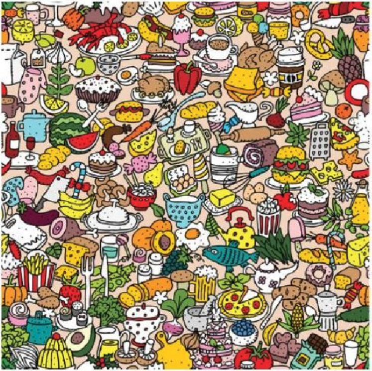

# Actividades Agosto - Diciembre 2023

---

 ***Profesor: Jesus Eduardo Alcaráz Chávez***
 
 ***Alumno: Edgar Carrillo Estrada***
 
 ***Fecha de entrega: 7 de Diciembre 2023***
 
---

## Índice
1. [*Introducción a la Inteligencia Artificial Actividad 1. Práctica 1*](#Elemento1)
2. [*Introducción a la Inteligencia Artificial: Tipos de Inteligencia*](#Elemento2)
3. [*Introducción a la Inteligencia Artificial: Introspección*](#Elemento3)
4. [*Introducción a la Inteligencia Artificial: Introspección*](#Elemento4)
5. [*Introducción a la Inteligencia Artificial: Introspección*](#Elemento5)
6. [*Introducción a la Inteligencia Artificial: El proceso de razonamiento según la lógica*](#Elemento6)
7. [*Introducción a la Inteligencia Artificial: El papel de la heurística*](#Elemento7)
8. [*Reglas y Búsquedas: Espacio de Estados*](#Elemento8)
9. [*Generación de Dataset*](#Elemento9)

---

## 1. Introducción a la Inteligencia Artificial Actividad 1. Práctica 1<a name="Elemento1"></a>

Los hombres se han denominado a sí mismos como Homo sapiens (hombre sabio) porque nuestras capacidades mentales son muy importantes para nosotros. Durante miles de años, hemos tratado de entender cómo pensamos; es decir, entender cómo un simple puñado de materia puede percibir, entender, predecir y manipular un mundo mucho más grande y complicado que ella misma. El campo de la inteligencia artificial, o IA, va más allá: no sólo intenta comprender, sino que también se esfuerza en construir entidades inteligentes.

Dado el texto anterior, se requiere hacer lo siguiente.

- Redactar un ensayo mínimo 2000 palabras, del capítulo 1,2, 26, 27, y el apartado A del libro: "Inteligencia Artificial. Un enfoque moderno".

---
### Ensayo del libro "Inteligencia Artificial. Un enfoque moderno"

Antes de poder empezar en forma con el tema de inteligencia artificial, debemos de establecer un punto de partida para poder estar dentro de la misma idea sobre qué es y qué aspectos se contemplan.

La inteligencia artificial se puede definir de distintas maneras dependiendo del enfoque que le queramos dar. Existen 4 enfoques generales con algunos ejemplos de sus definiciones:

- Sistemas que piensan como humanos
“El nuevo y excitante esfuerzo de hacer que los computadores piensen… máquinas con mentes, en el más amplio sentido literal” (Haugeland, 1985).
“La automatización de actividades que vinculamos con procesos de pensamiento humano, actividades como la toma de decisiones, resolución de problemas, aprendizaje…” (Bellman, 1978)

- Sistemas que actúan como humanos
“El arte de desarrollar máquinas con capacidad para realizar funciones que cuando son realizadas por personas requieren de inteligencia” (Kurzweil, 1990)
“El estudio de cómo lograr que los computadores realicen tareas que, por el momento, los humanos hacen mejor” (Rich Y Knight, 1991)

- Sistemas que piensan racionalmente
“El estudio de las facultades mentales mediante el uso de los modelos computacionales” (Charniak y McDermott, 1985)
“El estudio de los cálculos que hacen posible percibir, razonar y actuar” (Winston, 1992)

- Sistemas que actúan racionalmente
“La Inteligencia Computacional es le estudio del diseño de agentes inteligentes” (Poole et al., 1998)
“IA… está relacionada con conductas inteligentes en artefactos” (Nilsson, 1998)

Una vez que hemos definido que es una inteligencia artificial, podemos empezar a evaluarlas con mayor detalle. Para evaluar una inteligencia artificial, Alan Turing creo la famosa “Prueba de Turing”. Esta prueba se puede aplicar para evaluar un equipo de cómputo debe de tener la capacidad de procesamiento de lenguaje natural, representacion del conocimiento, razonamiento automático y aprendizaje automático. También existe una llamada Prueba Global de Turing la cual evalúa todo lo anterior y le agrega la visión computacional y robótica.

Para poder generar una inteligencia artificial que simule a un humano, primero debemos de poder entender cómo es que piensa un humano. Para poder hacer esto, existen dos formas posibles: por medio de la introspección y mediante experimentos psicológicos. En el campo interdisciplinario de la ciencia cognitiva convergen modelos computacionales de IA y técnicas experimentales de psicología intentando elaborar teorías precisas y verificables sobre el funcionamiento de la mente humana.

Los pilares de la inteligencia artificial se vienen formando en torno a diferentes áreas del conocimientos desde el principio de la humanidad hasta la actualidad. Estos pilares son multidisciplinarios ya que no solo depende del área tecnológica:

- Filosofía
- Matemáticas
- Economía
- Neurociencia 
- Psicología
- Ingeniería computacional
- Teorías de control y cibernética
- Lingüística 

La historia de la inteligencia artificial pasó por diferentes etapas desde sus inicios. El primer trabajo de IA fue realizado por Warren McCulloch y Walter Pitts en 1943. También una aportación por parte de Donald Hebb en 1949 sigue vigente, el cual propuso y demostró una sencilla regla de actualización para modificar las intensidades de las conexiones entre neuronas. Se le conoce como aprendizaje Hebbiano o de Hebb.

El nacimiento de la inteligencia artificial se dió en el año de 1956 después de varios años de trabajo. En el periodo de 1966 a 1973 se realizaron grandes avances y se logró generar un entusiasmo muy importante para proyectos futuros debido a las limitantes tecnológicas de la época, se hicieron predicciones de que en 1967 una computadora iba a ser campeón de ajedrez y se podrían demostrar teoremas matemáticos con una máquina, cosa que se logró en parte 40 años más tarde de lo esperado.

En la actualidad la inteligencia artificial tiene diferentes aplicaciones de forma muy general, y aquí se mencionan algunos ejemplos de ello: 
- Planificación autónoma: el programa de la NASA Agente Remoto se convirtió en el primer programa de planificación autónoma a bordo que controlaba la planificación de las operaciones de la nave espacial desde a bordo.
- Juegos: Deep Blue de IBM fue el primer sistema que derrotó a un campeón mundial en una partida de ajedrez cuando superó a Gary Kasparov por un resultado de 3.5 a 2.5 en una partida de exhibición.
- Control autónomo: El sistema de visión por computador ALVINN fue entrenado para dirigir un coche de forma que siguiese una línea; durante 2850 millas controló la dirección del vehículo en el 98% del trayecto.
- Diagnosis: Existen programas de diagnostico de enfermedades en ciertas áreas de la medicina.
- Planificación logística: Durante la crisis del Golfo Pérsico de 1991, las fuerzas de Estados Unidos desarrollaron la herramienta Dynamic Analysis and Replanning Tool (DART) para automatizar la planificación y logística del transporte. Se logró generar un plan en cuestión de horas, en comparación de semanas por otros métodos.
- Robótica: Existe actualmente asistentes robot de microcirugía, así como el sistema HipNav que ayuda creando un modelo tridimensional de la anatomía interna del paciente para guiar un implante de prótesis de cadera.
- Procesamiento del lenguaje y resolución de problemas: Existen varios programas de procesamiento de lenguaje natural y de resolución de problemas actualmente.

Un agente es cualquier cosa capaz de percibir su medioambiente con la ayuda de sensores y actuar en ese medio utilizando actuadores. El término percepción se utiliza en este contexto para indicar que el agente puede recibir entradas en cualquier instante. La secuencia de percepciones de un agente refleja el historial completo de lo que el agente ha recibido. Un agente racional es aquel que hace lo correcto en la circunstancia. 

Las medidas de rendimiento incluyen los criterios que determinan el éxito en el comportamiento del agente. Como regla general, es mejor diseñar medidas de utilidad de acuerdo con lo que se quiere para el entorno, más que de acuerdo con cómo se cree que el agente debe de comportarse.

Un agente racional se podría definir como un agente que en cada posible secuencia de percepciones, un agente racional deberá emprender aquella acción que supuestamente maximice su medida de rendimiento, basándose en las evidencias aportadas por la secuencia de percepciones y en el conocimiento que el agente mantiene almacenado.

Llevar a cabo acciones con intención de modificar percepciones futuras es una parte importante de la racionalidad, que lleva por nombre recopiacion de información o proceso. Se dice que un agente carece de autonomía cuando se apoya más en el conocimiento inicial que le proporciona su diseñador que en sus propias percepciones.

El entorno de trabajo de un agente son, esencialmente, los problemas para los que los agentes racionales son las soluciones. En estos entornos se utiliza el acrónimo REAS para referirse al Rendimiento, Entorno, Actuadores y Sensores. Al inicio del diseño de un agente debe de tomarse en cuenta de la forma más completa posible el entorno.

Existen varias propiedades de los entornos de trabajo:
- Totalmente observable vs parcialmente observable
- Determinista vs estocástico
- Episódico vs secuencial
- Estático vs dinámico
- Discreto vs continuo
- Agente individual vs multiagente

El trabajo de la IA es diseñar el programa del agente que implemente la función del agente que proyecta las percepciones en las acciones. Se asume que este programa se ejecutará en algún tipo de computador con sensores físicos y actuadores, lo cual se le conoce como arquitectura.

Agente = arquitectura + programa

Existen los agentes reactivos simples que seleccionan las acciones sobre la base de las percepciones actuales, ignorando el resto de las percepciones históricas.

Existen los agentes basados en modelos en donde el agente debe mantener algún tipo de estado interno que dependa de la historia percibida y que de ese modo refleje por lo menos alguno de los aspectos no observables del estado actual. El agente basado en objetivos además de la descripción del estado actual, necesita algún tipo de información sobre su meta que describa las sitaciones que son deseables.

Los agentes basados en la utilidad permiten tomar decisiones racionales en dos tipos de casos en los que las metas son inadecuadas. Primero, cuando hay objetivos conflictivos, y solo se puedan alcanzar algunos de ellos, la funcion de utilidad determina el equilibrio adecuado. Segundo, cuando haya varios objetivos por los que se puede guiar el agente, y ninguno de ellos se puede alcanzar con certeza, la utilidad proporciona un mecanismo para ponderar la probabilidad de éxito en función de la importancia de los objetivos.

Los agentes que aprenden se pueden dividir en cuatro componentes conceptuales:
- Elemento de aprendizaje: Es el responsable de hacer mejoras.
- Elemento de actuación: Es el responsable de la selección de acciones externas.
- Crítica: Se relaciona con el elemento de aprendizaje y determina cómo se debe modificar el elemento de actuación para proporcionar mejores resultados en el futuro.
- Generador de problemas: Es el responsable de sugerir acciones que lo guiarán hacia experiencias nuevas e informativas.

Los filósofos que estudian la inteligencia artificial definen dos tipos de hipótesis sobre éstas: 
- La hipótesis de la Inteligencia Artificial Débil: Es posible que las máquinas actúen con inteligencia (o quizá mejor, como si fueran inteligentes).
- La hipótesis de la Inteligencia Artificial Fuerte: Afirma que las máquinas sí piensan realmente (opuesto al pensamiento simulado).

Turing enumera varias acciones en las cuales se cumple el argumento de incapacidad, el cual dice “una máquina nunca puede hacer X”, por ejemplo:
- Ser amable
- Tener recursos
- Ser guapo
- Ser simpático
- Tener iniciativas
- Tener sentido del humor
- Distinguir lo correcto de lo erróneo
- Cometer errores
- Enamorarse
- Disfrutar con las fresas con nata
- Hacer que otra persona también se enamore
- Aprender de la experiencia
- Utilizar palabras de forma adecuada
- Ser el tema de su propio pensamiento
- Tener tanta diversidad de comportamientos como el hombre
- Hacer algo realmente nuevo

Turing, mediante su argumento de la informalidad del comportamiento afirmó que el comportamiento humano es demasiado complejo para poder captarse mediante un simple juego de reglas y que debido a que los computadores no pueden nada más que seguir un conjunto de reglas, no pueden generar un comportamiento tan inteligente como el de los hombres. En la IA la incapacidad de capturarlo todo en un conjunto de reglas lógicas se denomina problema de cualificación. 

Muchos filósofos han afirmado que una máquina que pasa el Test de Turing no quiere decir que realmente está pensando, sería solamente una simulación de dicha acción. El profesor Geoffrey Jefferson en 1949 dijo:

> “Hasta que una máquina pueda escribir un soneto o componer un concierto porque sienta los pensamientos y las emociones, y no porque haya una lluvia de símbolos, podría reconocer que la máquina iguala al cerebro, es decir, no sólo escribirlo sino que sepa lo que ha hecho.”

A esto anteriormente mencionado, Turing lo llama como el argumento de la consciencia, la máquina tiene que ser consciente de sus propias acciones y estados mentales.

El problema de mente-cuerpo cuestiona cómo se relacionan los estados y los procesos mentales con los estados y procesos del cuerpo. Este problema inicia desde René Descartes concluyó diciendo que el alma y el cuerpo son dos tipos de cosas diferentes; mientras que la teoría monista, frecuentemente llamada materialismo, mantiene que no existen cosas tales como almas inmateriales, sino sólo objetos materiales.

A nivel ético, el desarrollo de la inteligencia artificial implica demasiados temas sensibles, tan así que existe un manual sobre la Ética de los Computadores de Berleur y Brunnstein en el 2001. La IA parece que expone problemas nuevos como:
- Las personas podrían perder sus trabajos por la automatización
- Las personas podrían tener demasiado (o muy poco) tiempo de ocio.
- Las personas podrían perder el sentido de ser únicos
- Las personas podrían perder algunos de sus derechos privados
- La utilización de los sistemas de IA podría llevar a la pérdida de responsabilidad
- El éxito de la IA podría significar el fin de la raza humana

La explosión de inteligencia también ha sido llamada singularidad tecnológica por el profesor de Matemáticas y autor de ciencia ficción Vernor Vinge quien escribió que “Dentro de treinta años, tendremos el medio tecnológico de crear una inteligencia superhumana. Algún tiempo después, la era humana habrá acabado”.

Existen cuatro posibilidades para la generación de un agente que actúa racionalmente:
- Racionalidad perfecta: Un agente perfectamente racional actúa en cualquier instante de tal manera que maximiza la utilidad esperada, dada la información que haya adquirido del entorno.
- Racionalidad calculadora: Un agente calculadoramente racional finalmente devuelve lo que habría sido la opción racional al comienzo de su deliberación. Esta es una propiedad interesante para que un sistema la presente; sin embargo, en la mayoría de los entornos, la respuesta adecuada no tiene valor en el momento equivocado.
- Racionalidad limitada: Herbert Simon sugirió que la racionalidad limitada funciona en primer lugar satisfaciendo, es decir, deliberando sólo el tiempo necesario para elaborar una respuesta que sea lo suficientemente buena.
- Optimalidad limitada: Es un agente óptimo limitado se comporta todo lo bien que puede, dado sus recursos computacionales.

Para poder evaluar la rapidez de ejecución y memoria que requiere un algoritmo se requiere de hacer una prueba, pero existen dos maneras de hacerlo: la primera es realizar un benchmarking ejecutando el algoritmo en un computador y medir la velocidad en segundos y el consumo de memoria en bytes, pero esto implica que algún cambio en el hardware de la computadora afecta el rendimiento y no es tan fiable para escalar o exportar datos confiables. El segundo enfoque depende del análisis de algoritmos por medio de un análisis asintótico.

El uso de vectores, matrices y el álgebra lineal en la inteligencia artificial es de las bases esenciales para poder resolver problemas y planear el proceso de análisis de grandes cantidades de datos.

Así como el uso del algebra lineal es importante, las distribuciones de probabilidades ayudan a la toma de decisiones en la resolución de problemas por medio de inteligencia artificial para poder elegir la solución óptima.


---

- Redactar un ensayo del documental sobre IA mínimo 3000 palabras. [Video](https://www.youtube.com/watch?v=5rvZBsueMoc)

---
### Ensayo del documental "Inteligencia Artificial"

Muchas personas creen que la inteligencia es una cualidad única de los seres biológicos. En sí, no hay una definición para la inteligencia artificial, sino un conjunto de prácticas y piezas que las personas reúnen. La inteligencia artificial se puede definir en grandes rasgos como la capacidad de lograr objetivos complejos. 

Cuando una máquina muestra la capacidad de ver, escuchar, comprender y aprender sobre el mundo al igual que nosotros se le considera artificialmente inteligente. 

Entender el lenguaje es uno de los más grandes desafíos de los sistemas inteligentes. 

Desde hace tiempo, en las obras de ciencia ficción ha existido la capacidad de que una máquina se comunique sin ningún esfuerzo con los humanos utilizando lenguaje natural. Pero como puede suponerse, el hacer qué una máquina entienda nuestro lenguaje humano es una de las tareas más difíciles de la inteligencia artificial. Esto anterior es debido a que los lenguajes tienen matices y son complicados; presentan dificultades para las computadoras qué están acostumbradas a reglas fijas. El lenguaje se puede malinterpretar con facilidad, como se ejemplifica en la frase de Groucho Marx: 

> "Una mañana le dispare a un elefante en mi pijama"

> "One morning I shot an elephant in my pajamas" 

El comprender realmente lo que se dice es muy difícil para una computadora. Lo que intentamos lograr por medio del procesamiento del lenguaje natural es comenzar a descifrar qué significa cuando estas palabras en oraciones; como se relacionan las oraciones entre sí. 

Uno de los primeros grandes avances en el procesamiento del lenguaje natural se produjo cuando IBM desarrolló una inteligencia artificial llamada WATSON para competir en el programa de televisión Jeopardy. 

El equipo de IBM tardo años en desarrollar, perfeccionar y entrenar el sistema, incluidos meses de práctica en un set de televisión simulado. Para hacer de WATSON un contendiente, el equipo de IBM armó el sistema con algoritmos matemáticos avanzados y potentes tecnologías de inteligencia artificial como el aprendizaje automático. En febrero del 2011 debutó en televisión WATSON para mostrar al mundo lo que había aprendido. 

WATSON intenta comprender la pregunta dividiéndola en las distintas partes de una oración, después hace una búsqueda dentro de los miles de millones de libros, artículos y documentos que cubren la gran variedad de temas de Jeopardy para tener miles de posibles respuestas. Después recopila, analiza y compara la evidencia de todo el material para reducir estas posibilidades. 

Miles de algoritmos diferentes trabajan juntos para lograr reunir la evidencia de cada respuesta posible, y después las ordena de acuerdo con su peso de probabilidad. Estas tecnologías podrían ayudar a las industrias a resolver los problemas más difíciles del mundo que requieren gran procesamiento y análisis de datos. 

Cuando se toma una decisión, mayoritariamente se tiene un debate entre los pros y contras de cada una de las posibles decisiones, así que el desarrollar un sistema informático capaz de debatir puede leer miles de artículos, obtener sus ventajas y desventajas, y en base a ello tomar la mejor decisión en cuestión de segundos. 

El debatir es una tarea bastante complicada debido a que se requiere tener habilidades de pensamiento crítico y amplios conocimientos de una variedad de temas. Además de esto, los debatientes pueden usar el humor para presentar argumentos persuasivos a su contrincante. 

El punto clave para desarrollar un sistema informático capaz de debatir consiste en que el ser humano entiende con facilidad la pregunta, pero le cuesta almacenar y conseguir la mayor cantidad de información posible; para las computadoras es justo lo contrario, su fuerte es el almacenamiento de gran cantidad de información, pero le cuesta comprender las preguntas. 

Los seres humanos estamos tan acostumbrados a entender el lenguaje qué ni siquiera somos conscientes de lo difícil que es. Para nosotros es muy claro cómo construir un argumento, pero cuando tratamos de enseñarle a una computadora a entender el lenguaje tenemos elementos básicos. Le podemos enseñar a comprender las partes de una oración, identificar conceptos y con eso, quizá identificar conceptos similares, y con eso, identificar oraciones con similitudes. Pero en realidad debes decirle al sistema como unir los elementos de forma coherente. Un sistema de este tipo utiliza técnicas de procesamiento de lenguaje natural, aprendizaje automático y técnicas de razonamiento para entender los temas relacionados. 

Los autos qué se conducen solos han sido una constante en nuestra imaginación durante décadas. Una de las aplicaciones más conocidas por la gente es para los vehículos autónomos, pero la gente debe entender que aún no está listo a pesar de ver vehículos de prueba de Google y el modo autónomo de Tesla. 

La razón por la que aún no conseguimos llegar a la cima de los vehículos autónomos es porque conducir es difícil, y si agregamos el lidiar con condiciones climáticas como lluvia o nieve, o de noche se complica aún más. 

Muchos autos autónomos iniciaron sus entrenamientos en pistas de prueba y últimamente han salido a las calles a seguir sus entrenamientos; aunque accidentes recientes ponen en duda la capacidad de lograr perfeccionar estos sistemas. 

La inteligencia artificial en un vehículo ayuda a resolver la pregunta "¿Qué es lo que veo?" de acuerdo con las imágenes obtenidas de las cámaras alrededor el auto. A esta capacidad se le llama percepción. La otra cosa que debe hacer la inteligencia artificial es descubrir cómo se mueven los objetos que veo, a eso se llama predicción. Con estos dos puntos anteriores el auto debe preguntarse "¿A dónde quiero llegar?" 

Con la capacidad actual de la inteligencia artificial de aprender de la experiencia los vehículos autónomos podrían poblar las calles dentro de los próximos 10 años. Se estima que 1 de cada 4 autos en el futuro no necesitará conductor. 

En 1957 se desarrolló la primera máquina capaz de aprender a jugar damas inglesas mejor que la persona que desarrolló el código. Al analizar los datos de miles de juegos, el sistema aprendió qué movimientos conducían probablemente a una victoria. A esto se le llamó aprendizaje automático. 

En el aprendizaje automático una computadora analizará datos, encontrará patrones en esos datos y usa esos patrones para encontrar la mejor ruta hacia un objetivo.
Aunque este trabajo fue revolucionario, se tenían como limitantes los datos y la potencia de procesamiento de la época. Se usaba una computadora IBM 701 con solo 256 bytes de almacenamiento de memoria que aproximadamente el tamaño promedio de un tweet actual.

Enseñar a las computadoras a jugar juegos sigue siendo un banco de pruebas efectivo para el avance de la inteligencia artificial, y en 1996 la potencia de procesamiento había avanzado lo suficiente como para que la máquina Deep Blue de IBM derrotara al gran maestro Garry Kasparov en el ajedrez.
Un salto dramático en la potencia de procesamiento, un aumento masivo de datos y avances en algoritmos contribuyó a la revolución de la inteligencia artificial de hoy en día. 

Todos los días creamos más datos, más rápido que en ningún otro momento de la historia humana. Cada minuto vemos más de 4 millones de videos de YouTube, realizamos más de 3.5 millones de búsquedas en Google y escribimos tweets casi medio millón de veces.

La inteligencia artificial toma todos estos datos y aprende de ellos.  Lo hace a una escala que los humanos no podríamos hacer, como ver un millón de reglones de datos y darles algún sentido. Esta enorme cantidad de datos proporciona infinitas oportunidades para que las computadoras aprendan y para que los científicos de la computación experimenten y perfeccionen las técnicas de aprendizaje automático y debido a que todos contribuimos con los datos en internet, todos somos parte de ese experimento.

Cada vez que miramos nuestro smartphone, cada vez que le damos un clic a un enlace en algun sitio web, todos los sensores que nos rodean en la actualidad están rastreando información sobre nuestras vidas. En la actualidad, los sistemas de inteligencia artificial nos monitorean constantemente y ajustan sus resultados a nuestras preferencias, como Spotify, que genera una lista de reproducción personalizada para ti o como Facebook que elige tu contenido en tu feed de noticias; también están guiando cohetes espaciales que aterrizan solos para SpaceX; ayudan a los médicos a diagnosticar el cáncer mediante escáneres radiológicos.

En los últimos años ha habido avances espectaculares en el que muchas cosas que los expertos pensaban tardarían décadas, han sucedido de repente. Los sistemas de inteligencia artificial más antiguos que vencen a los mejores humanos en el ajedrez tienen la inteligencia programada en ellos por los humanos que saben cómo jugar; lo más moderno es que la máquina simplemente aprenda a jugar por ella misma. 

En 2013, los juegos de Atari 2600 como Space Invaders, Breakout, Seaquest y Pong fueron dominados por un sistema creado por Google llamado DeepMind, sin ningún aporte humano aparte de las reglas del juego.
Esta inteligencia artificial fue pionera en que aprendiera a jugar juegos de computadora, sin tener idea que es un juego o una pelota, un jugador o una puntuacion. Solo recibía datos de los píxeles en la pantalla y después de un rato, el mismo algoritmo simple tenía un rendimiento superhumano en gran cantidad de juegos diferentes. 

En 2017 la misma técnica de videojuegos simples fue adaptada a uno de los juegos más complejos jamás creados: Go. Go es un antiguo juego de mesa chino que es tan complejo que hay más posiciones en un tablero de Go que átomos en el universo. Un sistema de inteligencia artificial llamado “AlphaGo Zero” aprendió a jugar Go solo jugando consigo mismo, sin que se le mostraran juegos de ejemplo previamente. Las decisiones que tomó para ganar desafiaron todo lo que los humanos habían intentado antes.
Mientras que el aprendizaje automático generalmente implica aprender de grandes cantidades de datos, este programa se enseñó a si mismo a través del método más humano de prueba y error; en este proceso creó sus propios datos para aprender. La inteligencia artificial en este caso, para todos los efectos, es una forma de super inteligencia artificial que nos enseña cosas que nunca descubriríamos por nuestra cuenta. 

Históricamente, las maquinas han tomado el trabajo de los humanos desde la primera revolución industrial. Pero esta transición también creo nuestras primeras fabricas que generaron nuevos empleos que nunca habían existido.  Este ciclo de perdida y creación de empleos se repite a través de las décadas. 
Internet y la era digital eliminaron empleos como creador de mapas y mecanógrafo, agentes de viajes y operadores telefónicos. También redefinieron la industria de la música y el entretenimiento. Generaron una economía global con el mercado en línea y nuevos empleos que no se conocían hace veinte años como estrella de YouTube, gerentes de redes sociales y desarrollador de aplicaciones. 

Ahora estamos en el comienzo de otra revolución en la que los avances de la inteligencia artificial llegaran a todos los aspectos de nuestras vidas. Lo que sucede hoy, no es que las maquinas reemplacen a los humanos, sino que los humanos que trabajan con inteligencia artificial están reemplazando a los humanos que trabajan sin ella. 

En Boston Massachusetts, ReThink Robotics crea robots artificialmente inteligentes que son compañeros de humanos en las fabricas. El robot de esta empresa llamado Sawyer lleva mucha inteligencia artificial detrás de él. Sabe que tiene que acercarse a un objeto de una forma particular, sabe como colocar su brazo, y también tiene algunas reglas, por ejemplo, si tiene que tomar algo debe volver a intentarlo y tomarlo si en el primer intento no lo logró. 

El robot mide la fuerza a cada una de las 7 articulaciones que tiene y eso ayuda a identificar cuanta fuerza estamos empujando o incluso cuando carga algo sabemos cuánto pesa en realidad. Tiene una cámara y puede mirar alrededor de su área de trabajo, comprender cuando están cambiando las cosas para que pueda tomar las diferentes acciones. Este robot Sawyer aprende por demostración, no por programación. Esto permite que casi cualquier persona pueda capacitar al robot para realizar tareas.

A la hora de entretar al robot, el entrenador crea algunos puntos clave necesarios para completar la tareas, y la inteligencia artificial rellenará de forma automatica lo necesario para que se pueda terminar de realizar la accion establecida. En una empresa de Virginia, utilizan este robot para cortar madera en una fabrica de sellos debido a que es un trabajo muy tedioso y peligroso para que sea realizado por un humano; así como para llenar tinta que es un trabajo muy sucio y requiere de mucho tiempo.

Además de que es mas seguro utilizar un robot para cortar la madera necesaria para armar las monturas de los sellos, puede trabajar toda la noche para aprovechar el tiempo. Anteriormente, si se les solicitaban 100 monturas se debían de cortar, y hacer los agujeros en los trozos de madera para colocar las manijas sobre ellas. Ahora, el robot hace todo lo anterior. Con esto, los robot pueden hacer los trabajos repetitivos que aburren a las personas, y así estas personas pueden disfrutar sus trabajos y ser más eficaces como trabajadores y seres humanos.

Existen otros robots que muestran una agilidad similar a la humana, tal es el caso del robot Spot de Boston Dynamics. Éste puede abrir puertas y caminar a a traves de ellas, el robot Atlas puede correr, saltar y hacer parkour; sin embargo, también se crean otros robots que se parecen a los seres humanos.
Desde la antigüedad, las personas imaginaban robots que reproducian la imagen humana. El ser humano cuenta con el deseo de imitarse a si mismo a través de robots. Dentro de la ciencia ficción, en la pelicula “Blade Runner” existe un androide que no se distingue de los humanos, y fueron diseñados para copiar a los humanos en todos los sentidos. 

En Japón principalmente, existe todo un movimiento para intentar hacer que los robots parezcan lo más humanos posible y muchos investigadores y futuristas creen que es una actividad bastante contraproducente. Esto nos puede poner en el lugar en el que sintamos que las máquinas tienen, en cierto sentido, los mismos derechos que nosotros porque se parecen en apariencia. 

Dependiendo del tipo de robot, nos va a indicar que tan inteligente y consciente quieres que sea. Por dar dos ejemplos, no quieres que tu tostadora de pan sea demasiado inteligente o sea consciente de si misma ya que a nadie le gustaría estar haciendo pan tostado por el resto de su vida; por otra parte, si creamos un robot para cuidar gente mayor, nos gustaría que sus respuestas e interacción fuera lo mas cercano a un ser humano real consciente para que el usuario sienta esa cercanía y empatía sincera.

Todo el mundo aprende de forma diferente, y si existen herramientas que ayuden a personalizar este proceso sienta las bases para el aprendizaje permanente. Muchas experiencias para los niños son experiencias nuevas para ellos. Dentro del periodo de 0 a 8 años los niños aprenden la gran mayoría de las cosas. Los niños que inician la escuela más tarde, en comparación con los que la inician a temprana edad se quedan atrasados y todas las escuelas tiene diferencias drásticas. 

En escuelas con grupos grandes, lo mejor sería poder individualizar la enseñanza para cada uno de ellos, pero es muy difícil porque muchas veces en el salón de clases el profesor está solo y no se cuenta con ayuda adicional. 

IBM WATSON y Sesame Workshop están colaborando en un programa piloto y de investigación para una nueva aplicación que enseña vocabulario en la etapa temprana, enfocandose en los alumnos de jardin de niños. Se ha comprobado que los niños en niveles socioeconómicos altos escuchan treinta millones de palabras más a los 4 años que los niveles más bajos, y debido a eso les resulta más dificil aprender a lo largo de sus vidas. 
El desarrollo temprano es extremadamente importante para determinar el éxito de un niño en la vida, por lo que una aplicación como esta puede reducir la brecha anteriormente mencionada.

Al inicio de la aplicación ”Word Chow” es donde la mayoría de los niños empiezan. El juego consiste en que un personaje dice una palabra y el niño debe tocar la imagen que coincide con ella y el personaje se come dicha palabra. Cuando la imagen seleccionada es errónea, el personaje escupe dicha opción y te deja intentar una segunda vez. 

En la aplicación se hace un seguimiento de sus respuestas y se evalúa el conocimiento del niño de esa palabra en particular, y las palabras que aparecen después dependerá de como se desempeña en las evaluaciones; de esta forma, las palabras se ajustan de acuerdo a cada niño. A simple vista se ve como un simple juego para niños, pero detrás de ella la inteligencia artificial recopila datos y los algoritmos evaluan el nivel de vocabulacion en funcion de sus respuestas, luego predice y decide en que palabras debe de enfocarse el niño, ya que el camino de aprendizaje para cada uno es distinto.

Esta aplicación de vocabulario incluye juegos adaptables y videos del programa de televisión Plaza Sésamo, que enseñan nuevas palabras y refuerzan el aprendizaje. Una vez que el niño completa estas actividades de aprendizaje, esa palabra aprendida se agrega a su libro de palabras personal, una señal de confianza de que el niño entiende su significado.
Los niños que están dentro de este programa de pruebas mejoraron su lectura de forma significativa, superando las expectativas de sus profesores. Además, están utilizando las palabras aprendidas dentro de las 9 semanas que duró el programa piloto.

Los juegos artificialmente inteligentes se enfocan en niños pequeños, pero el adaptar los sistemas de inteligencia artificial para grados superiores podría enseñarte para aprender de forma más eficiente.
IBM también esta desarrollando un tutor artificialmente inteligente que ayuda a los estudiantes y profesores universitarios en colaboracion con la Universidad Pearson. Esta tecnología se ha desarrollado y probado con aproximadamente 800 estudiantes en 2 universidades de todo Estados Unidos. 

En la investigación es bien sabido que la tutoría privada impulsa el aprendizaje. Hay un estudio que dice que el 97% de los estudiantes que recibieron tutorias privadas tienen un desempeño 20% más alto que los demás. A pesar de los beneficios de la tutoría personal, es un enfoque dificil de implementar para todos los estudiantes cuándo y dónde lo necesiten. 

El tutor WATSON es un tutor virtual exclusivo para cada estudiante que habla con ellos. El tutor te hará una pregunta y si respondes de forma correcta todo sigue igual, sino, WATSON regresa y te hará una pregunta más especifica para irte guiando en la dirección correcta. Si no sabes la respuesta puedes pedir directamente que te guíe. 

WATSON adapta todo el conocimiento para el que ha sido entrenado para cada estudiante en particular en cada turno de la conversacion, y asi, en funcion de lo que diga el estudiante el tutor comenzará a guiarlos por un camino para demostrar el conocimiento.
Los profesores tambien pueden acceder al tutor WATSON para obtener informacion sobre el progreso de sus estudiantes y poder adaptar las clases conociendo los conceptos que más trabajo les cuesta entender a los estudiantes. Además de personalizar el aprendizaje para cada estudiante, ayuda a optimizar los tiempos de estudio.

La háptica es la ciencia de aplicar el tacto a nuestras interacciones con la tecnología, por ejemplo, la sensación cuando el teléfono vibra en vez de que emita un sonido. La empresa WearWorks ha diseñado unos dispositivos que guían a personas con problemas visuales en el mundo real.
Wayband es un brazalete háptico de inteligencia artificial que fue inicialmente pensado para ver su comportamiento al guiar a una persona con dificultad visual durante el maratón de Nueva York. 
La forma en que funciona la Wayband es que crea un corredor virtual un poco más ancho que un humano al trazar una ruta usando coordenadas GPS y aprendizaje automático. A través de la retroalimentación háptica se asegura de que el corredor está dentro de este corredor virtual. 

La forma en que el usuario sabe que está dentro del camino es que no recibe ninguna reacción. Tan pronto como se sale del camino recibe una pequeña notificación háptica para decir que debes regresar al camino.
El maratón de Nueva York es de los más grandes del mundo, hay cerca de 50 mil corredores por lo que es una prueba complicada para la Wayband. Al principio de la prueba, la Wayband experimentó algunos problemas, pero a pesar de eso, durante 21 de los 42 kilómetros del maratón funcionó sin problemas. Pero a partir de la mitad del recorrido las cosas comenzaron a complicarse debido a la gran cantidad de edificios y puentes metálicos que bloqueaban la señal del GPS junto con la gran cantidad de señales telefónicas de los usuarios interfirieron con las señales de la Wayband.

Luego, para agregar una dificultad extra, el clima lluvioso provocó que el sensor ultrasónico dejara de funcionar y tuvo que recurrir a sus guías para llegar a la meta, cosa que era regresar a la forma anteriormente usada por corredores con dificultad visual. 
A pesar de los grandes problemas a los que se enfrentó la Wayband durante el maratón, resultó para bien ya que se resaltaron los puntos a mejorar y ayudan a que productos como estos sean perfeccionados para que más personas en el mundo puedan llegar a tener acceso a dispositivos de este estilo lo antes posible. La verdadera mejora de estos dispositivos dependerá de personas que estén dispuestos a hacer este tipo de pruebas por el bien de los demás y que se vuelvan accesibles.

Así como en algún momento los primeros aviones eran muy rudimentarios en comparación de los aviones actuales, la inteligencia artificial pasa por un proceso similar. Este tipo de pruebas de concepto muestran lo que se puede lograr en los próximos años y dan un rumbo a seguir.

La inteligencia artificial presenta problemas en cuanto a temas de privacidad, debido a lo poderoso que se vuelve en temas de vigilancia, reconocimiento facial o cualquier tipo de biofirma que podamos aplicar.
La visión por computadora puede analizar las caras para identificar a las personas a través del reconocimiento facial. La forma en que esto funciona es que se observa una cara, extrae rasgos distintivos de ella como el tamaño, la posición de los ojos, la nariz, los pómulos y la mandíbula. Luego, busca otras imágenes con las mismas características. De esta misma manera es lo que aplica Facebook cuando te pregunta si quieres etiquetarte en una publicación o cuando los iPhone más recientes se desbloquean al escanear el rostro de su dueño. 

Actualmente, muchos aeropuertos están utilizando el reconocimiento facial para registrar a los pasajeros, compararlas con las fotos de los pasaportes y, de esta forma, agilizar los viajes. Muchas personas que buscan proteger la privacidad mencionan que esto va más allá de lo necesario.
El punto de inflexión está en donde qué tan dispuestos están los ciudadanos en perder su privacidad con el fin de garantizar la seguridad ante el Estado. En muchos eventos deportivos, conciertos y estaciones de tren los gobiernos están usando el reconocimiento facial para combatir y prevenir ataques terroristas. En China, 375 sospechosos fueron capturados gracias a estos sistemas de reconocimiento facial.

Un punto también muy importante es que de forma voluntaria muchas personas están aceptando perder cierta privacidad al introducir dispositivos como los asistentes virtuales Google Home o Amazon Alexa a sus hogares. 
Un paso aún más sorprendente sobre la inteligencia artificial y el reconocimiento facial es que se creó una que es capaz de distinguir personas homosexuales y heterosexuales basándose en las características faciales y las expresiones de las personas.

Se puso a prueba analizando las fotografías de un sitio web de citas y pudo determinar si los hombres era homosexuales o heterosexuales con un 81% de precisión y 74% para las mujeres de precisión.
De forma similar, en Tel Aviv, Israel desarrollaron un sistema que permite identificar por medio del rostro de las personas si es que tienen rasgos de personas que han cometido algún crimen con un 90% de confiabilidad. Esta inteligencia artificial no está conectada a ninguna base de datos de antecedentes penales, usa única y exclusivamente el rostro de las personas para determinar que tanta probabilidad hay de que sea un delincuente.
WATSON for drug discovery ayuda a los doctores procesando cantidades enormes de literatura medica junto con otros datos para ayudar a los investigadores a encontrar otros medicamentos para algunas de las enfermedades mas irritantes.

Enfermedades como el parkinson avanzan tan lento que es dificil de estudiarlas mejor, y actualmente se usan medicamentos para controlarla que tienen más de 60 años desde que se crearon.
Las revistas medicas publican cerca de medio millon de articulos al año, ningun medico investigador podria analizar toda esta informacion pero WATSON for drug discovery puede ayudar a los investigadores a encontrar rapidamente conexiones entre datos medicos y de medicamentos para saber si existe algun medicamento que pueda usarse de nuevas maneras para tratar el parkinson.

La inteligencia artificial esta siendo capaz de analizar el ADN de una persona para predecir sobre la susceptibilidad a cierto tipo de cancer o la eficacia de algun medicamento para un paciente.
Los humanos somos inteligencias generales ya que podemos hacer diferentes cosas en diferentes contextos. Las computadoras son extremadamente limitadas a lo que pueden hacer. El objetivo general es el poder crear una inteligencia general artificial que puede ser super adaptable, a esto tambien se le llama singularidad.
En la singularidad es donde la gente tiene miedo de que la inteligencia artificial supere a la humana y nos quite el control. Se cree que las superinteligencias artificiales no serán creadas por humanos, sino por otras mismas inteligencias artificiales. 


---

## 2. Introducción a la Inteligencia Artificial: Tipos de Inteligencia<a name="Elemento2"></a>

La Teoría de las Inteligencias Múltiples fue ideada por el psicólogo estadounidense Howard Gardner como contrapeso al paradigma de una inteligencia única.

Gardner propuso que la vida humana requiere del desarrollo de varios tipos de inteligencia. Así pues, Gardner no entra en contradicción con la definición científica de la inteligencia, como la "capacidad de solucionar problemas o elaborar bienes valiosos".

- Investigar la teoría de las inteligencias múltiples según Gardner
- Escribir un ensayo mínimo de 4 cuartillas de la teoría de las inteligencias múltiples según Gardner
- El ensayo debe ser escrito en markdown pueden utilizar jupyter notebook.

---
### Ensayo "Teoría de las inteligencias múltiples según Gardner"

Howard Gardner, nacido en 1943 en Scranton en Estados Unidos, es psicólogo, investigador y profesor de la Universidad de Harvard. Se trata de uno de los mayores referentes educativos de los últimos años. Fue alguien que redefinió, y revolucionó, el concepto de inteligencia al demostrar que no existe una sola manera de ser inteligente.
La idea de que no existe una sola manera de ser inteligente viene gracias al estudio de dos campos esenciales para el área de la educación: los procesos de aprendizaje y el funcionamiento del cerebro humano. Después de terminar sus estudios, Gardner trabajaba por las mañanas con pacientes que sufrieron daño cerebral y por las tardes con niños. Al trabajar con los pacientes aprendió que dependiendo de la zona donde se recibe el daño cerebral, habrá fortalezas y debilidades: pueden perder el habla, la destreza musical o la capacidad de orientarse.
Al trabajar con los niños se dio cuenta de un proceso muy similar: niños que son buenos para aprender idiomas, pero con dificultades para matemáticas; niños muy buenos para ciencia, pero no pueden analizar poesía.
Al relacionar estos ambos criterios, Gardner llegó a la conclusión de que el término inteligencia estaba mal definido, pues no existe una sola manera de ser inteligente ni existe la posibilidad de medir la inteligencia. Gardner define la inteligencia como:
>Un conjunto de capacidades cognitivas independientes y relacionadas entre sí que permiten a las personas resolver problemas, crear productos valiosos en la cultura y destacar en diferentes áreas de la vida.

Según Howard Gardner, existen varios tipos de inteligencias múltiples bien definidas, cada una de las cuales se distingue por habilidades y capacidades particulares. Entender que son las 8 inteligencias múltiples es fundamental para apreciar la diversidad de las capacidades humanas en distintos aspectos de la vida y el aprendizaje.

*Inteligencia lingüística*

La inteligencia lingüística se refiere a la capacidad que posee una persona para utilizar un lenguaje, bien sea escrito u oral, a un alto nivel.

Este tipo de inteligencia se distingue en aquellos individuos que tiene grandes habilidades comunicativas, facilidad en el aprendizaje de nuevos idiomas, capacidades para persuadir, crear historias, escribir poemas, fluidez en la expresión de sus ideas, comprender a otros a través de la comunicación verbal o escrita y otras habilidades similares.

Algunas actividades para desarrollar y potenciar la inteligencia lingüística son las siguientes:
- Leer y comprender la esencia de un libro
- Destinar unos minutos de forma diaria para aprender un nuevo idioma
- Ampliar el vocabulario buscando otras palabras (como sinónimos o conocer otras definiciones) para expresar conceptos o ideas más fácilmente.
- Fomentar un hábito de escritura, ello puede ser mediante la creación de cuentos cortos, generación de contenido de valor, introducirse a la poesía, etc.
- Tener como pasatiempos a juegos que utilicen palabras o letras. Muchos de estos juegos tienen una intención educativa, ayudando a las personas a redactar mejor, corregir sus errores gramaticales y mejorar en general sus habilidades de lenguaje.

Algunos de los personajes famosos con inteligencia lingüística son:

- William Shakespeare: Poeta, dramaturgo y actor inglés
- Dante Alighieri: Poeta y escritor italiano
- John Bowring: Lingüista, escritor, traductor y políglota italiano
- Giuseppe Gasparo Mezzofanti: Cardenal, lingüista y políglota italiano
- Pablo Neruda: Poeta y político chileno


*Inteligencia musical*

La inteligencia musical es aquella que se relaciona con la capacidad que posee un individuo en componer, percibir y apreciar las distintas formas musicales.

Alude también a las habilidades de canto sin importar el género musical, a la capacidad de tocar instrumentos musicales a un alto nivel, a la utilización de destrezas en agrupaciones musicales (orquestas, bandas, grupos de canto, etc.), en la dirección de grupos musicales (como director musical) y a la estimación de melodías.

La inteligencia musical se distingue en aquellos individuos con grandes capacidades musicales. Viéndose, por ejemplo, en personas que manejan fácilmente y a un alto nivel instrumentos musicales.

Algunas actividades para desarrollar y potenciar la inteligencia musical son las siguientes:
- Aprender a tocar un instrumento musical (piano, guitarra, tambor, trompeta, etc.)
- Tomar clases de música personalizadas o grupales
- Aprender sobre los géneros musicales que existen (rock, pop, electrónica, metal, flamenco, entre otros) y conocerlos con cierta profundidad. También se incluyen aquellos géneros que no son tan conocidos (City pop, UK garage, etc.)
- Estudiar las diversas formas musicales que existen. Por nombrar algunos, están: réquiem, polonesa, intermezzo, alborada y fantasía.
- Integrarse en ambientes dónde la música sea relevante de alguna manera. Ello puede ser academias de música, bandas musicales o relacionarse con cantantes o instrumentistas
- Conocer sobre la cultura musical de otros lugares del mundo
- Aprender a bailar varios géneros de música
Algunos de los personajes famosos con inteligencia musical son:
- Wolfgang Amadeus Mozart: Pianista, violinista, organista, compositor, director de orquesta y profesor de música
- Frédéric Chopin: Compositor, pianista y profesor de música.
- Ludwig van Beethoven: Violinista, pianista, organista, profesor de música y director de orquesta
- Richard Wagner: Pianista, compositor, crítico musical, director de orquesta y director de teatro

*Inteligencia lógica-matemática*

La inteligencia lógico-matemática es aquella que permite solventar problemas lógicos y matemáticos. Da uso del pensamiento lógico-matemático para utilizar la coherencia, racionalidad, deducción, números, símbolos, figuras geométricas y otros elementos propios de la lógica y las matemáticas para proponer soluciones, crear ideas y establecer conclusiones.

- Llevar a cabo ejercicios que permitan mejorar la capacidad de raciocinio: emplear las preguntas correctas, fomentar hábitos de lectura, dividir la información en pequeñas secciones para que sean más fáciles de asimilar y practicar videojuegos de inteligencia (ajedrez, cubo de rubik, rompecabezas, sudoku y otros puzles similares.).
- Aprender a identificar un problema, saber establecer un plan de acción, ejecutarlo y evaluar los resultados para sacar conclusiones.
- Plantearse metas simples en la cotidianidad. Por ejemplo: arreglar la cama o practicar un idioma durante un periodo corto de tiempo.
- Realizar ejercicios para desarrollar el pensamiento crítico, como: cuestionar todo aquello que se afirma como verdadero, buscar información para despejar dudas y contemplar las cosas desde una perspectiva objetiva.
- Estimular la memoria mediante actividades de memorización, para ello, se puede empezar con tareas simples, tal como memorizar números telefónicos, y luego ir subiendo la dificultad gradualmente, como tratar de recordar los detalles de un logo de una marca (colores, letras, formas, estilos tipográficos, etc.).


Algunos de los personajes famosos con inteligencia lógica-matemática son:
- Isaac Newton: Científico, físico, filósofo, inventor, alquimista y matemático inglés.
- Alan Turing: Matemático británico, uno de los precursores de la informática.
- Sofia Kovalévskaya: Matemática rusa con aportaciones en el campo del análisis, la mecánica y las ecuaciones.
- Katherine Johnson, Dorothy Vaughan y Mary Jackson: Grupo de mujeres matemáticas de origen afroamericano que, gracias a sus cálculos trabajando para la NASA, ayudaron de forma sustancial para la llegada del hombre a la Luna


*Inteligencia corporal kinestésica*

La inteligencia kinestésica corporal alude a la capacidad que tiene una persona para coordinar la mente con el cuerpo y así generar un rendimiento físico de alto nivel. Es decir, se refiere a la facultad para utilizar las virtudes del cuerpo humano y lograr una gran destreza física.

Como se aprecia, es una inteligencia que se puede contemplar en distintos ámbitos de la vida, ya que la utilización de alguna habilidad física, como la precisión, la fuerza, el equilibrio, la velocidad, la resistencia y la flexibilidad, son capacidades propias de esta Inteligencia.

Las personas con estas capacidades se expresan a través de la realización de actividades que requieran el uso de su cuerpo, desenvolviéndose con gran nivel en dichos contextos.

Algunos de los personajes famosos con inteligencia corporal kinestésica son:
- Rudolf Nuréyev: Bailarín que nació en la Unión Soviética.
- Florence Griffith Joyne: Atleta de velocidad estadounidense
- Christiaan Neethling Barnard: Cirujano cardíaco sudamericano
- Muhammad Ali: Boxeador estadounidense.

*Inteligencia espacial*

La inteligencia visual espacial se refiere a la capacidad que tiene una persona de pensar, representar y actuar efectivamente en espacios de dos o tres dimensiones. Tiene en cuenta, además, las diversas formas geométricas que constituyen el espacio, así como sus propiedades (ubicación, forma, color, volumen, ángulos, material, etc.).

Es la habilidad para visualizar y relacionar los objetos que existen en un determinado plano, y desenvolverse adecuadamente en ello.

Este tipo de inteligencia se puede contemplar en distintos ámbitos y en diferentes perfiles profesionales, como, por ejemplo: Topógrafos, cartógrafos, geógrafos, arquitectos, pilotos de barcos, conductores profesionales, dibujantes, ingenieros y diseñadores gráficos.

Algunos de los personajes famosos con inteligencia espacial son:
- Le Corbusier: Arquitecto, urbanista, pintor y escultor suizo.
- Richard Buckminster Fuller: Arquitecto, diseñador e inventor estadounidense.
- Edward Hopper: Fue un pintor estadounidense.
- Gerardus Mercator: Fue un geógrafo, cartógrafo y matemático flamenco.

*Inteligencia intrapersonal*

La inteligencia intrapersonal alude a la capacidad que posee una persona para conocerse a sí misma. Es decir, es la consciencia plena que tiene un individuo sobre sus fortalezas, sus debilidades, su personalidad, sus sentimientos y sus anhelos en la vida.

Es aquella inteligencia que permite a una persona saber a cabalidad, por medio del autoconocimiento, quién es ella en realidad.

Es una forma de proyectar con exactitud su forma más profunda de ser, ello incluye los aspectos positivos y los aspectos negativos.

Entre los perfiles profesionales en los que más se encuentra la inteligencia intrapersonal, están: Filósofos, psicólogos, antropólogos, escritores, etc.

Algunos de los personajes famosos con inteligencia intrapersonal son los siguientes:
- Sócrates
- Pitágoras
- Platón
- Aristóteles
- Demócrito
- Agustín de Hipona
- Parménides de Elea
- Heráclito de Éfeso
- Jean-Paul Sartre


*Inteligencia interpersonal*

La inteligencia interpersonal, también conocida como inteligencia social, se define como la capacidad que tiene una persona para comunicarse efectivamente con los demás, entenderlas emocionalmente y empatizar con ellas.
Los individuos con esta tipología intelectual son, por lo general, perfiles como: líderes políticos, líderes sociales, líderes empresariales, figuras influyentes, psicológicos, entrenadores deportivos, docentes, comunicadores sociales, vendedores profesionales, conferencistas, etc.
Algunos de los personajes famosos con inteligencia interpersonal son:
- Joe Girard: Vendedor profesional estadounidense. 
- Steve Jobs: Líder empresarial estadounidense, cofundador y presidente de Apple. 
- Coco Chanel: Empresaria y diseñadora de moda francesa. 
- Malcolm X: Político, orador y activista estadounidense. 

*Inteligencia naturalista*

La inteligencia naturalista se refiere a la capacidad de contemplar, identificar y clasificar a los seres vivos, así como comprender la relación que existen ellos. Es, también, la habilidad para intervenir en el medio ambiente y conseguir un objetivo en concreto.

Esta inteligencia permite distinguir especies, señalar sus diferencias o semejanzas, estudiar sus comportamientos y entender el vínculo existente entre cada una de ellas.

Dentro de los perfiles que más poseen esta tipología intelectual, están: Biólogos, científicos ambientales, ecólogos, botánicos, conservacionistas, etólogos, veterinarios, zoólogos, entomólogos, ictiólogos, ornitólogos, herpetólogos, naturalistas, etc.

Algunos de los personajes famosos con inteligencia naturalista son:
- Charles Darwin: Naturalista, biólogo, botánico, geólogo, entomólogo y apicultor británico
- Alexander von Humboldt: Naturalista, botánico, explorador, geógrafo, astrónomo originario del Reino de Prusia
- Mária Telkes: Científica e inventora de origen húngaro y con nacionalidad de estadounidense
- Rachel Carson: Bióloga marina, ambientalista, conservacionista, zoóloga y escritora estadounidense


---

## 3. Introducción a la Inteligencia Artificial: Introspección<a name="Elemento3"></a>

La introspección (del latín "introspicere" que significa "mirar en el interior") o inspección interna designa la idea de "mirar al interior". Se trata del conocimiento que el sujeto pueda adquirir de sus propios estados mentales, o sea, designa la situación, para un sujeto dado, de observarse y analizarse a sí mismo, interpretando y caracterizando sus propios procesos cognitivos y emotivos, por lo tanto se requiere resolver el siguiente problema analizado la forma es que usted mismo resuelve el problema. Redactar un ensayo de la solución de mínimo 3 cuartillas, escribir el documento en markdown.

Coloca ocho alfiles (cuatro negros y cuatro blancos) en un tablero de ajedrez reducido, tal como se ve en la figura. El problema consiste en hacer que los alfiles negros intercambien sus posiciones con los blancos, ningún alfil debe atacar en ningún momento otro del color opuesto. Se deben alternar los movimientos, primero uno blanco, luego uno negro, luego uno blanco y así sucesivamente. ¿Cuál es el mínimo número de movimientos en que se puede conseguir?.


---
### Ensayo de los 8 alfiles

Para explicar la solución de este problema vamos a numerar cada casilla como se muestra a continuación:

|1|2|3|4|
|:----|:----|:----|:----|
|5|6|7|8|
|9|10|11|12|
|13|14|15|16|
|17|18|19|20|

La posición inicial de los alfiles negros es 1,2,3,4 mientras que los alfiles blancos se encuentran en las casillas 17,18,19,20, teniendo dos alfiles que se moverán en las casillas blancas y dos que se moverán en las negras por cada color de las piezas, el tablero inicial se ve de esta manera donde N es para las piezas negras y b para las piezas blancas:

|N|N|N|N|
|:----|:----|:----|:----|
|5|6|7|8|
|9|10|11|12|
|13|14|15|16|
|B|B|B|B|

El juego comienza con las piezas blancas, y el primer movimiento es realizado por el alfil en la casilla 18, moviéndose a la casilla 15. Después, las piezas negras realizan su primer movimiento con el alfil de la casilla 3, desplazándose a la casilla 6. Considerando estos movimientos, el tablero quedará de la siguiente manera.

|N|N|3|N|
|:----|:----|:----|:----|
|5|N|7|8|
|9|10|11|12|
|13|14|B|16|
|B|18|B|B|

En el segundo turno el alfil blanco que se encuentra en la casilla 17 se mueve a la casilla número 8, dando por finalizado el turno. El alfil negro que se encuentra en la casilla 4, se mueve a la casilla número 13 dejando el tablero de la siguiente manera.

|N|N|3|4|
|:----|:----|:----|:----|
|5|N|7|B|
|9|10|11|12|
|N|14|B|16|
|17|18|B|B|

Hasta el momento los dos colores están actuando en forma espejo, es decir que hacen los mismos movimientos, pero del lado contrario, el alfil blanco que se encuentra en la casilla 19, se mueve a la casilla 14. El alfil negro que se encuentra en la casilla 2, se mueve a la casilla 7 dejando el tablero de la siguiente manera.

|N|2|3|4|
|:----|:----|:----|:----|
|5|N|N|B|
|9|10|11|12|
|N|B|B|16|
|17|18|19|B|

El alfil que se encuentra en la posición 15 se moverá a la casilla número 5 y acabará el turno de los blancos. El alfil negro que se encuentra en la casilla 6 se moverá a la casilla numero 16 y quedará el tablero de la siguiente manera.

|N|2|3|4|
|:----|:----|:----|:----|
|B|6|N|B|
|9|10|11|12|
|N|B|15|N|
|17|18|19|B|

En este momento los dos jugadores ya pueden guardar un alfil, empezando por el blanco que se encuentra en la casilla 8, se moverá a la casilla 3. El alfil negro que está en la casilla 13, se guardara en la casilla 18.

|N|2|B|4|
|:----|:----|:----|:----|
|B|6|N|8|
|9|10|11|12|
|13|B|15|N|
|17|N|19|B|

En el turno del blanco se moverá el alfil que está en la casilla número 14 hacia la casilla número 9. El turno del negro se moverá el alfil de la casilla 7 se moverá a la casilla 12 y el tablero queda de la siguiente manera.

|N|2|B|4|
|:----|:----|:----|:----|
|B|6|7|8|
|B|10|11|N|
|13|14|15|N|
|17|N|19|B|

En este turno el blanco moverá el alfil de la casilla 5 hacia la casilla 10. El jugador de las piezas negras moverá el alfil de la casilla 16 hacia la casilla 11 y el tablero quedará de la siguiente manera.

|N|2|B|4|
|:----|:----|:----|:----|
|5|6|7|8|
|B|B|N|N|
|13|14|15|16|
|17|N|19|B|

Ahora regresaremos el alfil de la casilla 9, a la casilla 19. También se regresará el alfil de la casilla 12, hacia la casilla numero dos 2 y el tablero estara de la siguiente manera.

|N|N|B|4|
|:----|:----|:----|:----|
|5|6|7|8|
|9|B|N|12|
|13|14|15|16|
|17|N|B|B|

En este momento los dos colores pueden guardar su segundo alfil, el blanco moverá su alfil de la casilla 10, a la casilla número 4. Por su parte el negro moverá su alfil de la casilla 11, para guardarlo en la casilla 17.

|N|N|B|B|
|:----|:----|:----|:----|
|5|6|7|8|
|9|10|11|12|
|13|14|15|16|
|N|N|B|B|

Hasta el momento el comportamiento de los turnos ha sido como en espejo, ambos tienen el mismo número de alfiles guardados, el blanco moverá su alfil de la casilla 20, hacia la casilla 10. El negro moverá el alfil de la casilla 1 a la casilla 11.

|1|N|B|B|
|:----|:----|:----|:----|
|5|6|7|8|
|9|B|N|12|
|13|14|15|16|
|N|N|B|20|

Ahora guardamos los alfiles de las esquinas para permitir más movimientos sin riesgo de que se capturen entre sí. El alfil blanco de la casilla 3 se moverá a la casilla 9, mientras que el alfil negro de la casilla 18 se moverá a la casilla 12. El tablero quedará de la siguiente manera.

|1|N|3|B|
|:----|:----|:----|:----|
|5|6|7|8|
|B|B|N|N|
|13|14|15|16|
|N|18|B|20|

El blanco moverá su alfil de la casilla 10 hacia la casilla 13, de manera de espejo el negro moverá su alfil 11 a la casilla 8.

|1|N|3|B|
|:----|:----|:----|:----|
|5|6|7|N|
|B|10|11|N|
|B|14|15|16|
|N|18|B|20|

Sacaremos de nuevo los alfiles que están en las casillas 19 y 2 respectivamente. El blanco que se encuentra en la casilla 19 se moverá a la casilla 16 y el negro que se encuentra en la casilla 2 se moverá a la casilla 5.

|1|2|3|B|
|:----|:----|:----|:----|
|N|6|7|N|
|B|10|11|N|
|B|14|15|B|
|N|18|19|20|

Ahora vamos a guardar los alfiles en su lado contrario, guardaremos el alfil blanco que se encuentra en la posición 16 lo guardamos en la posición 1. Mientras tanto el alfil negro que se encuentra en la posición 5, lo guardaremos en la posición 20 lo cual el tablero quedará de lasiguiente manera.

|B|2|3|B|
|:----|:----|:----|:----|
|5|6|7|N|
|B|10|11|N|
|B|14|15|16|
|N|18|19|N|

En este punto, dos alfiles están en su lugar y otros dos están fuera. En el próximo turno, el alfil blanco de la casilla 9 se moverá a la casilla 6, mientras que el alfil negro de la casilla 12 se moverá a la casilla 15. Esto resultará en el siguiente estado del tablero.

|B|2|3|B|
|:----|:----|:----|:----|
|5|B|7|N|
|9|10|11|12|
|B|14|N|16|
|N|18|19|N|

Ahora moveremos el alfil blanco que se encuentra en la casilla 13 a la casilla 7 y el alfil negro de la casilla 8 a la casilla 14, para alinearlos y en los próximos turnos ya poder guardarlo. El tablero quedará de la siguiente manera.

|B|2|3|B|
|:----|:----|:----|:----|
|5|B|B|8|
|9|10|11|12|
|13|N|N|16|
|N|18|19|N|

Ahora vemos que estamos a dos turnos de lograr cambiar todos los alfiles, el siguiente movimiento será guardar un alfil de cada color, empezaremos con el blanco de la casilla 6 se moverá a la casilla 3 y el alfil negro de la casilla 15, lo guardaremos en la casilla 18 y el tablero queda de la siguiente manera.

|B|2|B|B|
|:----|:----|:----|:----|
|5|6|B|8|
|9|10|11|12|
|13|N|15|16|
|N|N|19|N|

Como último paso, simplemente colocamos el último alfil blanco de la casilla 7 en la casilla 2 y el último alfil negro de la casilla 14 en la casilla 19. Este movimiento sigue el patrón establecido durante todo el juego. Con esto, hemos completado el juego, logrando el objetivo de intercambiar los alfiles sin que ninguno se atacara, con un total de 36 movimientos.

|B|B|B|B|
|:----|:----|:----|:----|
|5|6|7|8|
|9|10|11|12|
|13|14|15|16|
|N|N|N|N|


---


## 4. Introducción a la Inteligencia Artificial: Introspección<a name="Elemento4"></a>

La introspección (del latín "introspicere" que significa "mirar en el interior") o inspección interna designa la idea de "mirar al interior". Se trata del conocimiento que el sujeto pueda adquirir de sus propios estados mentales, o sea, designa la situación, para un sujeto dado, de observarse y analizarse a sí mismo, interpretando y caracterizando sus propios procesos cognitivos y emotivos, por lo tanto se requiere resolver el siguiente problema analizado la forma es que usted mismo resuelve el problema. Redactar un ensayo de la solución de mínimo 3 cuartillas, escribir el documento en markdown.

Se trata de contar el numero de elementos (islas) contenidos en la siguiente imagen, se requiere lo siguiente:

- Hacer un programa que pueda contar el numero de elementos que son del mismo color
- Utilizar método iterativo y recursivos


### Solucion del conteo de islas

El primer problema con el que nos enfrentaríamos sería el cómo identificar una isla del resto del tablero. Esto se soluciona simplemente poniendo una etiqueta diferente al del tablero. Por ejemplo, en una matriz podríamos meter puros “0” y a una isla el numero “1” para poder diferenciar una isla del tablero.

Un segundo problema que se puede ver es como saber si la isla es vertical u horizontal o incluso una cruz, en general la forma de la isla. Para detectar el espacio más cercano y al frente es decir el siguiente en la fila simplemente le sumariamos un 1 a la matriz y lo compararíamos con la etiqueta que corresponda, pero ¿qué pasa si la isla va en vertical?

Un tercer problema que se puede identificar es el como saber que una isla ya fue visitada y no volver a contarla y caer en un ciclo. Bueno ese problema es sencillo simplemente se cambia la etiqueta que tiene por una diferente a la del tablero y a la de la isla por ejemplo un “-1”.

Para la solución que plantee veremos la programación en Python directamente.

Primero se crea el tablero con las dimensiones que más te gusten para una visualización más clara de tablero.

``` python
import random
tam_filas = 4
tam_columnas = 6
arreglo = [[0] * tam_columnas for _ in range(tam_filas)]
```

En este caso solo se creó un tablero de 4*6 en un arreglo para simular las casillas del tablero. Todas las casillas o mejor dicho todo el arreglo se llena con el numero “0” para “poner vacío el tablero”

Lo siguiente por hacer es llenar el tablero con islas, el cual hice una función donde llena aleatoriamente el arreglo o el tablero con los números “0” y “1” de manera aleatoria para seguido de ello imprimir el arreglo para saber cómo quedarían las islas.

```python
def llenar():
    for x in range(tam_filas):
        for y in range(tam_columnas):
            arreglo[x][y] = random.randint(0, 1)
            print(f"  {arreglo[x][y]}  ", end="")
        print()
```

Después de ello hice la función contar_islas donde prácticamente se encuentra la solución a los problemas que este ejercicio plantea.

Primero se crea un contador inicializado en 0 para ir contando las islas en cada iteración. Seguido de esto se crea un ciclo for anidado con otro ciclo for para iterar cada uno de los espacios y dentro de este ciclo anidado viene la primera condición y es si en el camino de recorrer el arreglo se topa con la etiqueta de la isla es decir el numero “1”, si la condición se cumple entonces se va a la función buscar_vecinos para precisamente encontrar toda la isla completa. Se aumenta el contador de la isla cuando finalice y se regresa de la función la variable que estuvo contando las islas en cada iteración.

``` python
def contar_islas():
    islas = 0

    for x in range(tam_filas):
        for y in range(tam_columnas):
            if arreglo[x][y] == 1:
                buscar_vecinos(x, y)
                islas += 1

    return islas
```

La siguiente función se encarga de buscar todas las casillas por las cuales esta conformada la isla y esto lo hace a manera recursiva, en este caso para manejar la recursividad tenemos una condición o el estado base que es la condición para saber si ya no hay mas elementos dentro de la isla o si se sale del arreglo, o si ya se conto el elemento. En cualquiera de esos casos la función acaba ahí y se regresa ya sea a la misma función o a contar la siguiente isla. Eso es la primera condición que se puede observar en el código.

La función recibe 2 parámetros que es la posición en la que se encuentra el iterador en donde en la primera vuelta es 0,0. Primero se verifica el caso base donde este es si x o y son menores a 0 es decir si ya fueron visitados o si la casilla donde se posiciona se sale del arreglo o si este es 0 o diferente de 1.

Si cualquiera de esos casos no se cumple entonces quiere decir que la isla continúa haciéndose más grande y que no se ha terminado de cambiar todos los elementos de la isla por “-1” .

Entonces con los parámetros que se pasaron a la función, que marcan la posición de la casilla, se marca como visitada es decir con el valor de “-1”. Y se continúa buscando en la isla si tiene mas elementos. Por ejemplo, en la primera vuelta se posiciona en la primera casilla es decir 0,0 y en esa casilla hay un numero 1, entonces se cambia ese valor por -1, después de eso se le resta uno a la fila es decir los parámetros que se usan para llamar a la misma función de manera recursiva serian -1,0 como este valor entra en el caso base se regresa a la función donde los valores son 0,0 y sigue el curso de la función. Ahora se manda llamar asimismo la función pero con los valores 1,0  e igualmente lo hace con las columnas. Solo le suma o le resta a el segundo parámetro de la función para buscar.

```python
def buscar_vecinos(x, y):
    if x < 0 or y < 0 or x >= tam_filas or y >= tam_columnas or arreglo[x][y] != 1:
        return

    arreglo[x][y] = -1

    buscar_vecinos(x - 1, y) #Busca en las filas hacia atrás
    buscar_vecinos(x + 1, y) #Busca en las filas hacia adelante
    buscar_vecinos(x, y - 1) #Busca en las columnas hacia arriba
    buscar_vecinos(x, y + 1) #Busca en las columnas hacia abajo
```

y así con esta función recursiva no importa el tamaño, la forma de la isla o el tamaño del tablero siempre podrá contar las islas en el tablero. Una vez terminado de recorrer toda la isla y cambiar las etiquetas “1” por “-1” se regresa a la función contar_islas a sumar una isla al contador y seguir recorriendo el arreglo hasta encontrar otro numero 1 y repetir de nuevo todo el proceso recursivo ya que este “1” marcaria otra isla.

Y por último solo quedaría mandar llamar la función llenar para llenar de islas al tablero e imprimir la variable islas para saber cuántas islas conto la variable iterador durante el proceso.

```python
llenar()
    print("Numero de islas en la matriz:", contar_islas())
```


## 5. Introducción a la Inteligencia Artificial: Introspección<a name="Elemento5"></a>

La introspección (del latín "introspicere" que significa "mirar en el interior") o inspección interna designa la idea de "mirar al interior". Se trata del conocimiento que el sujeto pueda adquirir de sus propios estados mentales, o sea, designa la situación, para un sujeto dado, de observarse y analizarse a sí mismo, interpretando y caracterizando sus propios procesos cognitivos y emotivos, por lo tanto se requiere resolver el siguiente problema analizado la forma es que usted mismo resuelve el problema. Redactar un ensayo de la solución de mínimo 3 cuartillas, escribir el documento en markdown.

Una vez que se resolvió el algoritmo de las islas, en la siguiente imagen contar los elementos que tienen el color rojo.



### Solucion de elementos de color rojo

Vamos a explorar las diferencias entre los modelos de color RGB (Red, Green, Blue) y HSV (Hue, Saturation, Value) y cómo funcionan cada uno.

***Modelo de Color RGB***

1. Componentes:
    - Rojo (Red): Controla la intensidad del color rojo.
    - Verde (Green): Controla la intensidad del color verde.
    - Azul (Blue): Controla la intensidad del color azul.
2. Funcionamiento:
    - Cada componente varía en intensidad de 0 a 255.
    - La combinación de estos tres colores en diferentes intensidades crea una amplia gama de colores.
    - Por ejemplo, si los tres componentes están en su valor máximo (255, 255, 255), se obtiene blanco, mientras que si están en su valor mínimo (0, 0, 0), se obtiene negro.
3. Aplicaciones:
    - Ampliamente utilizado en la visualización de colores en pantallas de dispositivos como monitores, televisores y cámaras digitales.
    - En el diseño gráfico y la programación visual.

***Modelo de Color HSV***

1. Componentes:
    - Matiz (Hue): Representa el tipo de color en grados (0-360).
    - Saturación (Saturation): Mide la intensidad del color (0-100%).
    - Valor (Value): Mide la luminosidad del color (0-100%).
2. Funcionamiento:
    - Matiz define el tipo de color en la rueda de colores.
    - Saturation controla la pureza del color, con 0% siendo un tono de gris.
    - Value representa la luminosidad, donde 0% es negro y 100% es blanco.
    - Este modelo es más intuitivo para la selección y manipulación de colores.
3. Aplicaciones:
    - Ampliamente utilizado en el diseño gráfico y la edición de imágenes.
    - Facilita el ajuste intuitivo de colores al permitir cambios independientes en matiz, saturación y valor.

***Diferencias Clave***

1. Representación:
    - RGB se basa en la mezcla aditiva de luces para formar colores.
    - HSV se enfoca en la percepción humana del color, facilitando la manipulación intuitiva.
2. Selección de Colores:
    - RGB es más técnico y menos intuitivo para la selección de colores.
    - HSV proporciona una rueda de colores más natural para el ojo humano.
3. Manipulación de Imágenes:
    - HSV es más comúnmente utilizado en aplicaciones de edición de imágenes debido a su naturaleza intuitiva.

Ahora que entendemos un poco mejor estos dos tipos de representación de los colores vemos claramente que es más fácil manipular los colores cuando utilizamos el HSV ya que podemos seleccionar más fácilmente algún color o colores en específico. Así que para darle una solución al problema de detectar los objetos rojos en una imagen utilizaremos esta gama de colores en HSV.

A continuación, explicaré la solución que propuse para este problema.

Primero que nada, se debe de leer la imagen la cual contendrá los objetos de color rojo y además de importar la librería de CV lo cual se hace de la manera siguiente.

```py
import cv2 as cv 
img = cv.imread("images/f1.jpg")
```

Después de esto asignamos el rango de colores en HSV para el color rojo, para esto se marca un color alto y un color bajo que es la gama de colores rojo que se tomarán en cuenta para los objetos, entre más ajustada estén estos altos y bajos mejor será la detección del color, en este caso el sistema HSV tiene dos espectros de color rojo por lo cual en las siguientes líneas de código tenemos 2 valores para alto y 2 valores para bajos.

```py
redBajo1 = (0,100,20)
redAlto1 = (4,255,255)

redBajo2 = (174,100,20)
redAlto2 = (179,255,255)
```

seguido de esto debemos de cambiar el espectro de BGR a HSV de la imagen para poder trabajar con los colores correspondientes. Y esto se hace con una función de CV tal cual se muestra a continuación

```py
img1 = cv.cvtColor (img, cv.COLOR_BGR2HSV)
```

Una vez que tenemos la imagen en colores HSV debemos de crear unas mascaras que servirán para que únicamente se muestren los objetos que tienen los valores de rojo que declaramos anteriormente que son los de redBajo y redAlto. Se crean ambas mascaras para filtrar los objetos de color rojo y como son 2 diferentes se crean 2 por separado para después combinarlas con la función de cv.add() justo como se muestra a continuación. Una vez aplicadas estas mascaras estas quedaran en una escala de blanco y negro es decir estarán binarizadas.

```python
mask1 = cv.inRange (img1, redBajo1, redAlto1)
mask2 = cv.inRange (img1, redBajo2, redAlto2)
mask = cv.add(mask1, mask2)
```

seguido de esto limpio con operadores morfológicos para disminuir el ruido de los objetos detectados y también falsos positivos o pixeles de rojo que son diminutos.

```py
kernel = cv.getStructuringElement(cv.MORPH_ELLIPSE, (3, 3))
limpio = cv.morphologyEx(mask, cv.MORPH_OPEN, kernel)
```

Hasta este punto en la imagen limpio podemos ver ya todos los objetos de color rojo aislados y simplemente quedaría contarlos. Para ello debemos de detectar los contornos que se generaron de cada uno de los objetos, para ello creamos una tupla para todos los contornos que hemos aislado con las máscaras anteriormente mencionadas. Se inicializa un contador en 0 para ir contando los objetos de la imagen y se crea un ciclo para recorrer todas las figuras que se detectaron para poder tener más información sobre ellas.

```py
ctns, _ = cv.findContours(limpio, cv.RETR_EXTERNAL,cv.CHAIN_APPROX_SIMPLE)
cont = 0
for c in ctns:
```

Dentro del ciclo se crea una variable que toma en cuenta el área del objeto que se detecto para saber el tamaño de este y hacer una condición para que solo tome en cuenta los objetos de cierto número de pixeles y evitar los que probablemente sean un falso positivo. Si el objeto es lo suficientemente grande se crea un rectángulo de color negro sobre la imagen original para poder detectar con facilidad el objeto que es de color rojo y por último se aumenta el contador de objetos.

```py
for c in ctns:    area = cv.contourArea(c)
    if (area > 15):
        x,y,w,h = cv.boundingRect(c)
        cv.rectangle(img,(x,y),(x+w,y+h), (0,0,0),2)
        cont = cont + 1
```

por ultimo se crea un texto sobre la imagen con la función de cv.putText() pasándole el contador de objetos, la posición que deseamos que se muestre el resultado del contador de objetos y también el color, fuente y tamaño de la letra para posteriormente mostrar las capas utilizadas y la imagen original con los objetos encerrados en un cuadrado negro y el contador de objetos arriba a la izquierda de color rojo.

```py
cont = str(cont) + " objetos rojos"
cv.putText(img, str(cont), (20,30), cv.FONT_HERSHEY_SIMPLEX, 1, (0,0,255), 2)
cv.imshow ('limpio', limpio)
cv.imshow ('mask', mask)
cv.imshow ('original', img)
cv.waitKey ()
cv.destroyAllWindows ().
```

## 6. Introducción a la Inteligencia Artificial: El proceso de razonamiento según la lógica<a name="Elemento6"></a>

Dado el siguiente problema, hacer el planteamiento matemático y programar el siguiente problema:

La historia que sigue es una versión adaptada de lo que -supuestamente- sucedió durante el siglo I. Sí, el siglo uno, Suena raro, ¿no? Más aún: esa historia dió origen a un problema clásico de la matemática/computación que sobrevivió el paso del tiempo. Se lo conoce con el nombre del "Problema de Josephus", ya que se supone que fue Flavius Josephus, un historiador judío nacido en Jerursalén, quien describió la situacion que vivieron él y 40 soldados que lo acompañaban.

En un momento determinado de la guerra judeo-romana, Josephus y su grupo cayeron en una emboscada y quedaron atrapados en una caverna rodeada de soldados enemigos. Después de debatir cómo proceder, optaron por suicidarse antes de ser capturados. Sin embargo, Josephus no estuvo de acuerdo con la propuesta y para que nadie tuviera que quitarse la vida, propuso el siguiente método:

"Sentémonos todos en un círculo. Alguno de nosotros empezará primero y matará a quien tenga sentado a la izquierda y así vamos a seguir hasta que -claramente- quedará nada más que uno solo de nosotros con vida. Ese será el único en suicidarse".


Allí están las cuarenta y un posiciones numeradas en forma creciente. Supongamos que empieza el que está sentado en la posición número 1. Ese soldado matará al 2. Luego, el 3 matará al 4, el 5 al 6... y así siguiendo.

Como usted advierte, llegará un momento en el que habrán muerto todos los que están sentados en las posiciones que llevan un número par, pero cuando muera el último de ellos, el número 40 (a manos del 39), el 41 estará vivo aún y ahora, el que tiene sentado a la izquierda es el número 1, el 3 matará al 5, etc. Creo que ahora está claro que van a morir todos hasta que quede solamente uno con vida. 

Es aquí donde aparece una parte interesante de la historia de Josephus. En principio, habrían de morir todos los soldados que estaban con Josephus en la caverna, pero la diferencia es que quien quedara último tendría que suicidarse... Más aún: el sobreviviente tendría que quitarse la vida y no habría ningún otro integrante del grupo que estuviera vivo para verificar que lo hiciera.

Como usted se imagina, Josephus eligió un lugar particular del círculo y se sentó allí. El sabía que siguiendo las reglas escritas más arriba, él habría de quedar como único sobreviviente. Esperó que todos estuvieran muertos, y en lugar de suicidarse, salió de la caverna y se entregó al enemigo.

Pregunta: ¿En qué lugar se sentó Josephus?

El problema es muy conocido en el mundo de la matemática y los programadores, y es por eso que hay muchísima literatura escrita sobre el tema, pero no hace falta saber nada particular para poder pensarlo. La versión que figura más arriba es solo una de las posibles variantes (la más sencilla) y si yo estuviera junto a usted, le sugeriría que no empiece con el caso de los 41 soldados, sino que intente con números más pequeños (de soldados) de manera tal de ver si le es posible intuir o imaginar una estrategia para determinar al ganador o sobreviviente a medida que va incrementando el número de soldados.

De la misma forma, una vez que hayamos resuelto el problema para 41 soldados, sería interesante pensar en una estrategia que permita deducir cuál será la posición ganadora en el caso general, es decir, independizarse del número 41 y encontrar alguna estrategia o fórmula que permita deducir el número que hay que elegir sin tener que recorrer todos los pasos intermedios.

Para resolver este tipo de problemas algo que solemos hacer mucho es hacer unos cuantos casos a mano y tratar de encontrar una regularidad vamos a llamar S(n) al superviviente en un círculo de n personas o soldados.

Vamos con algunos ejemplos. Si n es 1 pues S(1) es 1. Si n es 2 el 1 mata al 2 y sobrevive el 1 asi que S(2) = 1. Si n es 3 entonces el uno mata al 2 y el 3 mata al 1 así que S(3) = 3. Siguiendo este ejemplo podemos llenar una tabla como la siguiente.

|n|1|2|3|4|5|6|7|8|9|10|11|12|13|14|15|16|17|
|:----|:----|:----|:----|:----|:----|:----|:----|:----|:----|:----|:----|:----|:----|:----|:----|:----|:----|
|S(n)|1|1|3|1|3|5|7|1|3|5|7|9|11|13|15|1|3|

Analizando un poco esta tablita nos podemos dar cuenta ya varias cosas. Primero que todos los S(n) son números impares así que con esta conclusión podemos decir que ponerse en un numero par no es una muy buena idea.

Además podemos ver que existe cada ciertos tiempos un 1. Este numero 1 aparece en cuando n vale 1, 2, 4, 8, 16, esto quiere decir que aparece cuando n es potencia de 2. A continuación comprobaremos lo de los pares y lo de las potencias de dos para comprobar que no es solo una casualidad.

Primero lo mas sencillo, ¿los números pares siempre mueren?. Pues si por lógica todos los pares mueren en la primer ronda ya que el uno mata al 2 el 3 al 4 el 5 al 6 y así hasta terminar la ronda, así que los pares mueren todos en la primera ronda.

Lo de las potencias de 2 es un poco mas complicado pero demos un ejemplo. Si tenemos que el número n de personas en el círculo es par ocurre siempre que en la primera ronda los pares mueren y le toca actuar de nuevo al número uno, pero ahora tenemos la mitad de personas en el círculo o sea n/2 que si vuelve a ser par estaremos en la misma situación inicial pero con la mitad de soldados y se volverá a cumplir que en el circulo quedará un numero que es potencia de 2 hasta que queda solamente una persona, que es la persona que inicio todo. Esto comprueba que S(n)=1 si n es una potencia de 2.

Ahora para el caso general podemos decir que todo número se puede poner como una Potencia de dos más otro numero. Por ejemplo el 18 = 2^4 + 2. Bueno pues para resolver una parte hacemos lo siguiente: supongamos que el numero de soldados es 2^a+m. Vamos a hacer solo “a” turnos los primeros “A” impares matan a su compañero y entonces le toca el turno al número 2m+1 entonces ya encontramos al superviviente y será el de esta formula.

En el caso de Flavio josephus que eran 41 personas resulta que 41 es 2 elevado a 5 + 9 o sea que M es 9 con lo que la posición del superviviente es la 19.

Por ultimo realice este programa que puede detectar la posición que sobrevivirá tomando en cuenta las condiciones anteriormente explicadas, La primer condición es por si se igresa un 0 en el numero de soldados, este regresa un False ya que pues este problema necesita tener mas de 1 soldado, la segunda condición es por si el numero es par y que el numero de soldados sea exactamente una potencia de 2 si se cumple entonces la posición que se salvará será la numero 1.

Si no se cumplen estas condiciones quiere decir que estamos en el caso general es decir la formula 2m+1 y se hacen las operaciones necesarias para poder realizar la formula y finalmente se retorna el valor de la posición que se salvará.

```py
#La formula que da solucion a cualquier numero de soldados es 2m + 1
import math
def josephus(n):
    if n <= 0:
        return False
    n1=n
    n1 = math.log2(n)
    if n%2 == 0 and n1.is_integer():
        return 1
    else:
        potencia = math.floor(math.log2(n))
        #print(potencia)
        m = n - 2**potencia
        posicion_vive = 2*m+1 ##Formula para cualquier numero impar
        return posicion_vive
num_soldados = 41
posicion = josephus(num_soldados)
print("La posicion que vive es: ", posicion)
```

## 7. Introducción a la Inteligencia Artificial: El papel de la heurística<a name="Elemento7"></a>

Los laberintos de forma cuadrada o rectangular son los más antiguos que existen; la primera representación conocida de un laberinto de este tipo se encuentra en una tablilla de Pilo y también aparece, como sello, en las tumbas del antiguo Egipto, donde se hizo famoso desde la antigüedad el Laberinto de Fayum, citado por Heródoto. Los laberintos de forma redonda o circular aparecieron a fines del siglo VII a.  C. en la Italia etrusca; más tarde, aparecen en las monedas de Cnosos, a finales del siglo III a. C. y se cree que eran usadas como mapa del célebre Laberinto de Creta.

Los laberintos se clasifican básicamente en dos grandes grupos "según la relación que existe con el centro y la salida del mismo". El primer grupo de estos laberintos es el laberinto clásico o laberinto univiario: es el que hace recorrer, al ingresar en él, todo el espacio para llegar al centro mediante una única vía, camino o sendero; es decir, no ofrece la posibilidad de tomar caminos alternativos, no hay bifurcaciones, sino que existe una sola puerta de salida, que es la misma por la que se entra al laberinto. Por el hecho de tener un solo camino o sendero que seguir a medida que se avanza dentro de él, no es posible perderse en su interior. Por ser el laberinto más sencillo es frecuentemente utilizado para realizar experimentos de robótica en informática, especialmente populares en Japón.

1. Dado el siguiente laberinto:


- Definir qué es la heurística y cuál es su papel en la resolución de problemas
- Resolver con recursividad, programar
- Proponer Algoritmo de Solución, programar
- Describir el punto anterior


### Resolucion del laberinto

La heurística juega un papel crucial en la resolución de problemas al proporcionar atajos o enfoques prácticos que permiten superar la complejidad computacional o la falta de información completa. En lugar de buscar exhaustivamente todas las posibles soluciones, que podría ser impracticable o llevar mucho tiempo, la heurística ayuda a dirigir la atención hacia soluciones más prometedoras, permitiendo un uso más eficiente de los recursos y tiempo disponibles.

A continuación, se presenta un código que resuelve cualquier laberinto utilizando un enfoque recursivo. Primero, creamos el laberinto representado como una matriz, donde las paredes se indican con el número "1", los espacios vacíos con el número "0", la salida del laberinto con el número "2" y el camino para resolver el laberinto con el número "3".

```py
laberinto = [[1,1,1,1,1,1,1,1,1],
             [0,0,0,0,0,0,1,0,1],
             [1,1,1,0,1,1,1,0,1],
             [1,0,0,0,1,0,1,0,1],
             [1,0,1,1,1,0,1,0,1],
             [1,0,0,0,0,0,0,0,1],
             [1,0,1,1,1,0,1,0,1],
             [2,0,1,0,0,0,1,0,1],
             [1,1,1,1,1,1,1,1,1],
]
```

A continuación, presento la función recursiva denominada buscar() que se encarga de resolver el laberinto. La función contiene condiciones para validar la posición (x, y) dentro de los límites del laberinto y establece casos base para determinar si se ha encontrado la salida (2). Además, se asegura de no visitar paredes (1) o celdas ya marcadas (3).

Dentro de la tercera condición, se implementa una llamada recursiva para explorar los cuatro vecinos de la casilla actual. Esta recursividad permite buscar el camino de solución del laberinto y marcar las celdas con "0" o "1", dependiendo de la configuración del laberinto. La función continúa hasta encontrar la salida marcada como "2".

Finalmente, se llama a la función con las coordenadas iniciales (1, 0) y se imprime el laberinto resuelto.

```py
def buscar(x, y):
    if x < 0 or y < 0 or x >= 9 or y >= 9:
        return
    if laberinto[x][y] == 2:
        return True
    elif laberinto[x][y] != 1 and laberinto[x][y] != 3:
        laberinto[x][y] = 3
        if buscar(x-1, y) or buscar(x+1, y) or buscar(x, y-1) or buscar(x, y+1):
            return True
        else:
            laberinto[x][y] = 0

# Resolver el laberinto desde la posición inicial (1, 0)
buscar(1, 0)

# Imprimir el laberinto resuelto
for x in range(9):
    for y in range(9):
        print(f"  {laberinto[x][y]}  ", end="")
    print()
```

## 8. Reglas y Búsquedas: Espacio de Estados<a name="Elemento8"></a>

- Generar los espacios de estados de los siguientes problemas:

### Juego de las ranas

El juego consiste en pasar las 3 ranas verdes a la derecha y las 3 ranas marrones a la izquierda.  Las ranas pueden saltar a una piedra vacía que tengan delante, o saltar por encima de otra rana si en medio de ambas hay una piedra vacía.  


*Espacios de estados*


| MOVIMIENTO |POSICION 1 | POSICION 2 | POSICION 3 | POSICION 4 | POSICION 5 | POSICION 6 | POSICION 7 |
|------------|-----------|------------|------------|------------|------------|------------|------------|
|1|V3|V2|V1|-|M1|M2|M3|
|2|V3|V2|-|V1|M1|M2|M3|
|3|V3|V2|M1|V1|-|M2|M3|
|4|V3|V2|M1|V1|M2|-|M3|
|5|V3|V2|M1|-|M2|V1|M3|
|6|V3|-|M1|V2|M2|V1|M3|
|7|-|V3|M1|V2|M2|V1|M3|
|8|M1|V3|-|V2|M2|V1|M3|
|9|M1|V3|M2|V2|-|V1|M3|
|10|M1|V3|M2|V2|M3|V1|-|
|11|M1|V3|M2|V2|M3|-|V1|
|12|M1|V3|M2|-|M3|V2|V1|
|13|M1|-|M2|V3|M3|V2|V1|
|14|M1|M2|-|V3|M3|V2|V1|
|15|M1|M2|M3|V3|-|V2|V1|
|16|M1|M2|M3|-|V3|V2|V1|


### Juego de los misioneros y canibales

Tres misioneros se perdieron explorando una jungla. Separados de sus compañeros, sin alimento y sin radio, solo sabían que para llegar a su destino debían ir siempre hacia adelante.  Los tres misioneros se detuvieron frente a un río que les bloqueaba el paso, preguntándose que podían hacer. De repente, aparecieron tres caníbales llevando un bote, pues también ellos querían cruzar el río. Ya anteriormente se habían encontrado grupos de misioneros y caníbales, y cada uno respetaba a los otros, pero sin confiar en ellos.  Los caníbales se daban un festín con los misioneros cuando les superaban en número. Los tres caníbales deseaban ayudar a los misioneros a cruzar el río, pero su bote no podía llevar más de dos personas a la vez y los misioneros no querían que los caníbales les superaran en número. ¿Cómo puede resolverse el problema, sin que en ningún momento haya más caníbales que misioneros en cualquier orilla del río? Recuerda que un misionero y un caníbal en una orilla del río más uno o dos caníbales en el bote al mismo lado, significa que los misioneros tendrán problemas.         


*Espacios de estados*

| MOVIMIENTO | MISIONEROS OESTE | CANIBALES OESTE | MISIONEROS ESTE | CANIBALES ESTE | BALSA |
|------|-------------------|------------------|------------------|-----------------|-------|
| 1    | 3                 | 3                | 0                | 0               | OESTE |
| 2    | 3                 | 1                | 0                | 2               | ESTE  |
| 3    | 3                 | 2                | 0                | 1               | OESTE |
| 4    | 3                 | 0                | 0                | 3               | ESTE  |
| 5    | 3                 | 1                | 0                | 2               | OESTE |
| 6    | 1                 | 1                | 2                | 2               | ESTE  |
| 7    | 2                 | 2                | 1                | 1               | OESTE |
| 8    | 0                 | 2                | 3                | 1               | ESTE  |
| 9    | 0                 | 3                | 3                | 0               | OESTE |
| 10   | 0                 | 1                | 3                | 2               | ESTE  |
| 11   | 0                 | 2                | 3                | 1               | OESTE |
| 12   | 0                 | 0                | 3                | 3               | ESTE  |


## 9. Generación de Dataset<a name="Elemento9"></a>

Un conjunto de datos (conocido también por el anglicismo dataset, comúnmente utilizado en algunos países hispanohablantes) es una colección de datos habitualmente tabulada.

En el caso de datos tabulados, un conjunto de datos contiene los valores para cada una de las variables organizadas como columnas, como por ejemplo la altura y el peso de un objeto, que corresponden a cada miembro del conjunto de datos, que están organizados en filas. Cada uno de estos valores se conoce con el nombre de dato. El conjunto de datos también puede consistir en una colección de documentos o de archivos.

- Generar un dataset de rostros por lo menos 5 diferentes

### Código para generar dataset

El código para generar un dataset consiste en un programa que toma imágenes de la cámara del dispositivo, y de esa imagen se toma solamente una sección de la imagen para aumentar la precisión o enfoque de los elementos a utilizar para el dataset.

En esta primera parte, importamos las librerias y creamos una variable llamada cap en la cual vamos a estar recibiendo la informacion de la cámara. Pasamos como parámetro a la función el número 0 debido a que vamos a tomar en cuenta la webcam de nuestra laptop. Si tuvieramos 2 o más cámaras conectadas debemos de revisar cual número le corresponde, por ejemplo, podríamos pasar el número uno para usar una cámara que esté conectada por medio de USB.

``` py
import cv2 as cv
import numpy as np
import os

cap = cv.VideoCapture(0)

```

Ahora, debemos de poner dentro de un ciclo infinito el codigo para estar leyendo cuadro por cuadro de la imagen tomada por la webcam para que se vayan guardando los archivos. Creamos un rectangulo dentro de la imagen para que el usuario pueda posicionarse dentro de éste y que se tome la información de esa zona.

Todo esto va a detenerse cuando el usuario presione la tecla "Escape" dentro de su teclado y cerrará el programa.

```py


i = 0

while True:
    i = i + 1

    ret, frame = cap.read()
    if ret == False: break

    
    cv.rectangle(frame, (190, 80), (450, 398), (255,0,0), 2)

    frame2 = frame[80:398, 190:450]
    

    cv.imshow("frame", frame)
    

    cv.imwrite(f'C:\\Users\\edgar\\Desktop\\dataset\\img{i}.jpg', frame2)


    k = cv.waitKey(1)
    if k == 27:
        break

cap.release()
cv.destroyAllWindows()


```

